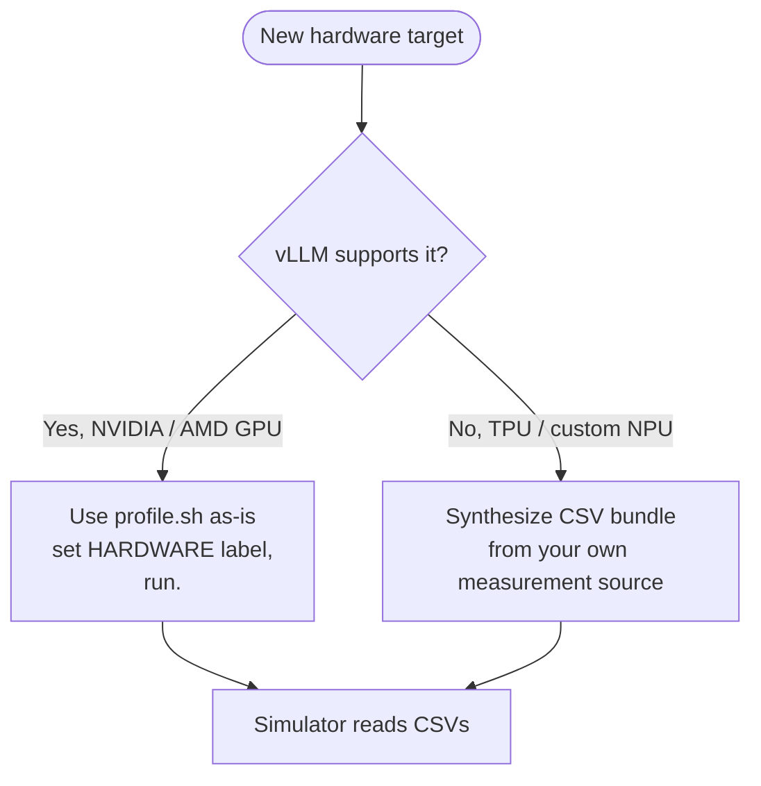

# 添加新硬件

本页是在 `profiler/perf/<HARDWARE>/` 下还没有剖析数据包的全新硬件目标的上线流程。根据 vLLM 是否支持该硬件，有两条不同的路径：



**[输出数据包](./output-bundle)** 中描述的 CSV 数据包格式就是契约。一旦您产生一个，无论数据是如何收集的，模拟器都以同样的方式工作。

## 添加新 GPU

这是简单的情形。剖析器基于 vLLM 的工作流程已经处理好了。三个步骤：

### 1. 确认 vLLM 支持

剖析器默认运行 vLLM `0.19.0`（`scripts/docker-vllm.sh` 拉取 `vllm/vllm-openai:v0.19.0`）。检查 vLLM 的发布说明是否提到您的 GPU。

| GPU 家族 | vLLM 0.19.0 支持 |
| --- | --- |
| NVIDIA A100, H100, H200 | 是 |
| NVIDIA RTX PRO 6000, RTX 6000 Ada, L40S | 是 |
| NVIDIA Blackwell (B100, B200) | 是（用 CUDA 13.x 镜像：`v0.19.0-cu130`） |
| NVIDIA Hopper SXM | 是 |
| AMD MI300X | 是（ROCm 路径；需要 `vllm/vllm-rocm`） |
| AMD MI200 / 更老 | 有限；检查 vLLM 兼容矩阵 |
| Intel Gaudi 3 | 有限（HPU 插件）；此剖析路径不支持 |

如果 vLLM 还不支持，您有两个选择：等 vLLM 添加支持，或向上游 vLLM 贡献后端。两者都不快。

### 2. 编辑 `profile.sh`

```bash
HARDWARE="H100"                 # or whatever you want as the folder name
TP_DEGREES="1,2,4,8"
MEASUREMENT_ITERATIONS=3
# ... other knobs as needed
```

`HARDWARE` 只是一个标签，选一个好记的。模拟器稍后通过 `cluster_config.hardware` 引用它。

对于不常见的 GPU 类型，您可能需要调整：

- 针对内存限制调整 `MAX_NUM_BATCHED_TOKENS` 和 `MAX_NUM_SEQS`
- 如果 KV 缓存内存比同代 HBM GPU 小得多，调整 `ATTENTION_MAX_KV`
- 如果 GPU 缺少 bf16 支持（现代 GPU 上很少见），调整 `DTYPE`

### 3. 运行

```bash
./profiler/profile.sh
```

等待。喝杯咖啡。输出落在 `profiler/perf/<HARDWARE>/<MODEL>/<variant>/`。大致时间参见 **[运行 → 预期运行时间](./running#expected-runtime)**。

完成后，模拟器即可使用，无需进一步更改。更新您的 `cluster_config.json` 设置 `"hardware": "<HARDWARE>"` 并运行。

### AMD ROCm 说明

官方的 `vllm/vllm-rocm` Docker 镜像是 AMD 的对应物。编辑 `scripts/docker-vllm.sh` 拉取该镜像而不是 `vllm/vllm-openai`。除了换镜像，剖析工作流程完全相同。

例如 `HARDWARE="MI300X"`：选一个合理的就行。

## 添加非 GPU 硬件

这是更复杂的情形。基于 vLLM 的剖析器不适用于 vLLM 无法运行的硬件（TPU、没有 HPU 支持的 Intel Gaudi、自定义 NPU / 加速器）。但模拟器只关心 **CSV 数据包格式**，不关心数据是如何产生的。

策略：从您自己的测量来源，以[输出数据包](./output-bundle)格式合成 CSV。

### 数据的三个来源

#### 1. 厂商分析模型 / 周期精确模型

大多数厂商为其硬件维护内部性能模型。如果您能访问：

- 用厂商模型为模拟器架构 YAML 声明的层类型计算内核级延迟（`qkv_proj`、`attention`、`down_proj` 等）。
- 扫描 GPU 剖析器相同的轴（`tokens`、`(prefill_chunk, kv_prefill, n_decode, kv_decode)`、`(tokens, activated_experts)`）。
- 按 **[输出数据包](./output-bundle)** 记录的 schema 写 CSV。

这会产生最准确的模拟器预测，因为层之间的相对延迟反映了您硬件的实际行为。

#### 2. 外部模拟器

如果您有分析计算模拟器（GEMM-perf、roofline，或来自已发表论文的周期精确模型），把剖析器本会剖析的形状喂给它，并导出相同的 CSV 格式。

`profiler/models/<model_type>.yaml` 的架构 YAML 声明了您需要计时的内核。对于 `catalog:` 部分的每个条目，您需要：

- `dense` 类别：作为 `tokens` 函数的延迟。
- `per_sequence`：作为 `sequences` 函数的延迟。
- `attention`：`(prefill_chunk, kv_prefill, n_decode, kv_decode)` 上的 4D 表。
- `moe`：`(local_tokens, activated_experts)` 上的 2D 表。

#### 3. 从数据表 / 公开基准手工编写

最后手段。如果您只有硬件的峰值 FLOPs / 内存带宽 / 延迟数字：

1. 为每种层类型计算 roofline 风格延迟。
2. 写 CSV。保持粗略，每个轴几行就足以做首次粗略检查。
3. 针对能找到的同一硬件 × 模型组合的任何公开基准做验证。

这会产生乐观的预测（没有真实的内核开销），因此请谨慎使用。另外两条路径强烈优先。

### `meta.yaml` 中放什么

即使是在合成时，也写一个 `meta.yaml`，让模拟器的运行时警告正常工作：

```yaml
profiler_version: "synthetic-v1"
vllm_version: "n/a"
gpu: "<driver device name, or n/a>"
hardware: "<HARDWARE>"          # must equal the folder name
variant: "<VARIANT>"
model: "<org>/<name>"
tp_degrees: [1]
profiled_at: "<date>"

engine_effective:
  max_num_batched_tokens: <whatever your CSVs cover>
  max_num_seqs: <ditto>

skew_fit:
  enabled: true                 # REQUIRED, see below
  per_tp:
    1:
      method: "synthetic-constant"
      alpha_default: 0.3
```

`hardware` 是集群配置的 `hardware` 字段必须匹配的文件夹名；`gpu` 是自由格式的来源信息。它们是独立的字段——不要把标签同时放进去。

`engine_effective` 只取两个批处理边界；那里没有 `dtype` / `kv_cache_dtype` 键，因为 dtype 编码在 `variant` 中。只有这两个会被读取，而且只是为了发出扫描边界警告。

`attention_grid` 和 `skew_profile` 是给人看的来源信息，**运行时不会读取**，因此您可以在合成数据包中省略它们，或者随意填写。

:::danger[没有 `enabled: true`，`alpha_default` 不起作用]
`_skew_alpha` 返回模块回退值——即 **0**，也就是完全没有偏斜修正——除非 `skew_fit.enabled` 为真。因此一个携带 `alpha_default: 0.3` 但没有 `enabled` 标志的数据包会静默应用 `alpha = 0`，而不是 `0.3`。它还需要一个所模拟 TP 的 `per_tp[<tp>]` 条目；没有的话会回退到顶层 `skew_fit.alpha_default`，然后到 0。

如果您确实没有偏斜数据，诚实的选择是完全省略 `skew_fit` 并接受 `alpha = 0`（`t_mean`）。借来的常数不是安全的默认值：端点间隙 `(t_max - t_mean)` 是迭代的一大块，因此 alpha 必须精确到约 ±0.02 才值得应用。
:::

没有异构解码测量时，省略 `skew.csv` 和 `skew_fit.csv`。

### 可以省略什么

- 没有异构解码数据时省略 `skew.csv` 和 `skew_fit.csv`——参见上面关于其代价的警告。
- 不在该硬件上建模 MoE 时省略 `moe.csv`（只在运行 MoE 模型时需要）。
- 不需要模拟的 TP 度数省略 `tp<N>/` 文件夹。注意机制：`_load_perf_db` 加载它找到的**每个** `tp*/` 文件夹，然后检查您的集群配置需要的那些在其中。缺失是硬错误，不是回退：

  ```text
  FileNotFoundError: No profile data for tp=[4] under
  perf/<hw>/<model>/<variant>/. Re-run the profiler with TP_DEGREES
  including 4.
  ```

### 不能省略什么

- `dense.csv`：每个模型都使用 dense 线性层。
- `per_sequence.csv`：`lm_head` 和 `sampler` 总是运行。
- `attention.csv`：每个模型都有注意力。
- `meta.yaml`：没有它模拟器无法解析变体。

### 验证

合成 CSV 数据包之后：

1. **冒烟测试**：用小工作负载（`workloads/example_trace.jsonl`）和指向您新 `HARDWARE` 的单实例配置运行模拟器。
2. **与已知参考比较**：如果您的硬件有公开模型已发布的延迟数字，运行匹配的工作负载并检查 TTFT / TPOT 在合理范围内匹配。
3. **检查吞吐量日志**：每迭代的 `prompt_t` 和 `decode_t` 值应该大致合理（不能高出或低出 10 倍）。
4. **注意启动时的"外推"警告**。如果您的 CSV 太粗糙，模拟器会警告；如果精度重要，加密相关轴。

## 在哪里使用

一旦您的 CSV 数据包位于 `profiler/perf/<HARDWARE>/<MODEL>/<variant>/`，当集群配置命名匹配的值时，模拟器会自动拾取：

```json
{
  "hardware": "<HARDWARE>",
  "model_name": "<MODEL>",
  "tp_size": <N>
}
```

`--dtype` 和 `--kv-cache-dtype` CLI flags 通过 `resolve_variant()` 解析到正确的 `<variant>` 文件夹（参见 **[模拟器 → 轨迹生成](../simulator/trace-generation#variant-resolution)**）。

## 接下来

- **[输出数据包](./output-bundle)**：您需要产生（或让剖析器产生）内容的 schema 参考。
- **[添加模型架构](./adding-model-architecture)**：单独的关注点，仅当模型的 `model_type` 不在 `profiler/models/` 中时需要。
