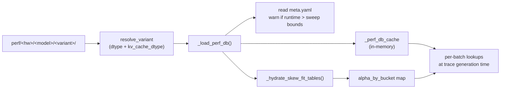

# 输出数据包

每次剖析运行都会在 `profiler/perf/<HARDWARE>/<MODEL>/<variant>/` 下产生一个目录树。这是**剖析器与模拟器之间的契约**：任何以正确格式落在这里的东西都可以被 `trace_generator._load_perf_db()` 消费，无论它是如何产生的。

## 文件夹布局

```
profiler/perf/<HARDWARE>/<MODEL>/<variant>/
├── meta.yaml
└── tp<N>/                        # one folder per profiled TP degree
    ├── dense.csv
    ├── per_sequence.csv
    ├── attention.csv
    ├── moe.csv                   # MoE models only
    ├── skew.csv                  # skew-enabled runs only
    └── skew_fit.csv              # skew-enabled runs only
```

`<variant>` 由 dtype 组合自动命名（`bf16`、`bf16-kvfp8`、`fp8-kvfp8`……）：参见 **[运行 → 输出命名](./running#output-naming)**。同一硬件 × 模型的多个变体作为兄弟文件夹共存。

`tp<N>/` 为 `TP_DEGREES` 中的每个 TP 存在。架构 YAML 中标为 `tp_stable: true` 的层（layernorm、sampler）在 TP=1 时剖析一次，并由 writer **复制**到其他 TP 文件夹。

## 时间单位是微秒

所有 `time_us` 列都以**微秒**为单位。模拟器在加载时乘以 1000 并四舍五入为纳秒。如果您手工编写 CSV（参见[添加非 GPU 硬件](./adding-hardware#adding-non-gpu-hardware)），记得使用 μs。

## `dense.csv`

```
layer,tokens,time_us
act_fn,1,4.21367
act_fn,2,5.36533
...
qkv_proj,1,20.4373
qkv_proj,2,20.4813
...
```

| 列 | 含义 |
| --- | --- |
| `layer` | 规范层名（必须匹配架构 YAML 的 catalog） |
| `tokens` | 该采样的 `total_len` |
| `time_us` | 测量的内核延迟，微秒 |

模拟器在查找时对 `tokens` 做 **1D 线性插值**。

它覆盖的层：`embedding`、`layernorm`、`qkv_proj`、`qk_norm`、`rotary_emb`、`o_proj`、`gate_up_proj`、`act_fn`、`down_proj`、`final_layernorm`。（YAML catalog 中类别为 `dense` 的任何条目。）

## `per_sequence.csv`

```
layer,sequences,time_us
lm_head,1,1075.13
lm_head,2,1044.52
...
sampler,1,25.9333
...
```

| 列 | 含义 |
| --- | --- |
| `layer` | `lm_head` 或 `sampler` |
| `sequences` | 该采样的 `num_requests`（解码轮按序列运行） |
| `time_us` | 测量的内核延迟 |

模拟器：对 `sequences` 做 **1D 线性插值**。

## `attention.csv`

4D 注意力表，覆盖纯预填充、纯解码和混合内核形状：

```
prefill_chunk,kv_prefill,n_decode,kv_decode,time_us
0,0,1,16,8.08533
0,0,1,32,8.17033
...
512,2048,4,128,...
...
```

| 列 | 含义 |
| --- | --- |
| `prefill_chunk` | 本次迭代中预填充块的 token 数。`0` = 纯解码 |
| `kv_prefill` | 预填充块所关注的 KV 缓存历史长度 |
| `n_decode` | 本次迭代中并发解码请求数。`0` = 纯预填充 |
| `kv_decode` | 解码请求所关注的 KV 缓存历史长度 |
| `time_us` | 测量的注意力内核延迟 |

模拟器做 **4D 线性插值**：四个轴中的每一个都由其两个相邻的被剖析值括起来并线性混合，在网格之上从最高的两个采样外推。

网格是几何的（默认倍增，由 `ATTENTION_CHUNK_FACTOR` 和 `ATTENTION_KV_FACTOR` 控制）。更小的值使网格更密集；更大的值以一定精度代价加速剖析。

## `moe.csv`（仅 MoE 模型）

```
tokens,activated_experts,time_us
1,8,50.2297
2,8,56.1917
...
```

| 列 | 含义 |
| --- | --- |
| `tokens` | 分发后单个 rank 上的本地 token 数 |
| `activated_experts` | 该 rank 上触及的不同专家数 |
| `time_us` | 单个 rank 上测量的 MoE 块延迟 |

模拟器：在 `(tokens, activated_experts)` 上做 **2D 线性插值**。只在 **TP=1** 剖析，提高 TP 不会改变每 rank 的专家内核。模拟器通过调整专家到 rank 的分配来处理 `ep_size`，而不是重新剖析。

## `skew.csv`（启用偏斜的运行）

原始异构解码采样：

```
regime,n,nb,ratio,skew,pc,kp,kvs,kv_big,kv_mean,t_mean_us,t_max_us,t_skew_us,alpha
pure,4,1,0.25,4.0,0,0,512,2048,896,74.784,118.88,74.657,-0.0029
pure,4,1,0.25,4.0,0,0,2048,8192,3584,169.854,321.566,171.394,0.0102
...
```

这些列捕获每个双峰批次的原始形状和三次测量：

| 列 | 含义 |
| --- | --- |
| `regime` | `pure`（仅解码）或 `mixed`（带预填充块） |
| `n` | 批次中的总解码数 |
| `nb` | "大"解码数（离群 KV 桶） |
| `ratio` | `nb / n` |
| `skew` | 大 KV 与小 KV 之比（`kv_big / kvs`） |
| `pc` | 预填充块大小 |
| `kp` | 预填充块的 KV 历史 |
| `kvs` | 小解码 KV |
| `kv_big` | 大解码 KV（`kvs * skew`） |
| `kv_mean` | `(nb * kv_big + (n-nb) * kvs) / n` |
| `t_mean_us` | 所有解码均匀处于平均 kv 时的延迟 |
| `t_max_us` | 所有解码均匀处于最大 kv 时的延迟 |
| `t_skew_us` | 实际双峰混合下的延迟 |
| `alpha` | `(t_skew - t_mean) / (t_max - t_mean)`。**不夹取**——14–20% 的行是负的，2–5% 超过 1，如上方的示例行所示。当 `t_max <= t_mean` 时为 `nan`，拟合会丢弃这些行 |

方法论：**[偏斜与 alpha 拟合](./skew-alpha-fit)**。

## `skew_fit.csv`（启用偏斜的运行）

模拟器在运行时实际消费的按桶拟合 alpha 表：

```
pc,n_label,skew_rate_label,kv_big_label,kp_label,alpha,n_samples
0,n<=128,sr<=15%,kvB<=16k,kp=0,0.0322,4
0,n<=128,sr<=15%,kvB<=1k,kp=0,0.0323,4
...
```

| 列 | 含义 |
| --- | --- |
| `pc` | 预填充块桶（原始值） |
| `n_label` | `n_decode` 桶标签 |
| `skew_rate_label` | 偏斜率桶标签。与 alpha 不同，率本身*确实*被夹取到 [0, 1]——固定分箱 `sr<=5%` / `sr<=15%` / `sr<=40%` / `sr<=70%` / `sr>70%` |
| `kv_big_label` | 大 KV 桶（log-4× 分箱） |
| `kp_label` | `kv_prefill` 桶标签 |
| `alpha` | 该桶的拟合加权-LS alpha |
| `n_samples` | 贡献的 `skew.csv` 行数 |

标签是拟合器输出的可读比较字符串（`n<=128`、`kvB<=4k`、`kp=0`），不是 slug——模拟器从 `meta.yaml::skew_fit.bucket_axes` 重建它们并将它们连接成键 `pc={pc}|{n_label}|{sr_label}|{kvb_label}|{kp_label}`，因此它们必须逐字符匹配。

因为这些轴记录在 meta 中而不是硬编码，扩大剖析扫描会点亮更细的分辨率而无需修改模拟器：`n` 和 `kp` 每个唯一被剖析的值获得一个分箱，`kv_big` 将其 log-4x 分箱扩展到观测到的最大值。

## `meta.yaml`

`tp<N>/` 文件夹的兄弟文件。下面是一个真实的例子，来自 `profiler/perf/RTXPRO6000/Qwen/Qwen3-32B/bf16/`，每 TP 的拟合块被裁剪为一个条目：

```yaml
profiler_version: 1.0.0
vllm_version: 0.19.0
cuda_version: '13.0'
gpu: NVIDIA RTX PRO 6000 Blackwell Server Edition
hardware: RTXPRO6000
profiled_at: '2026-04-24T12:35:08+00:00'
architecture: qwen3
architecture_sha256: c0557f326f38c70b46b5841c90d3447863d653dc9a228019db74eec591c2bf78
model: Qwen/Qwen3-32B
variant: bf16
tp_degrees: [1, 2]
engine_effective:
  load_format: dummy
  enforce_eager: true
  skip_tokenizer_init: true
  enable_prefix_caching: false
  generation_config: vllm
  tensor_parallel_size: 1
  block_size: 16
  gpu_memory_utilization: 0.9
  max_num_batched_tokens: 2048
  max_num_seqs: 256
  hf_overrides:
    num_hidden_layers: 1
    intermediate_size: 12800
    num_attention_heads: 32
    num_key_value_heads: 4
    vocab_size: 75968
  worker_extension_cls: profiler.hooks.extension.Extension
  model: /tmp/profiler_model_dnlix5xf
attention_grid:
  max_kv: 16384
  chunk_factor: 2.0
  kv_factor: 2.0
  chunks: 0, 16-2048 x2
  n_decode: 0, 1-256 x2
  kv: 0, 16-16384 x2
measurement_iterations: 3
skew_profile:
  enabled: true
  factors: {n: 2.0, pc: 2.0, kp: 2.0, kvs: 2.0}
  grid:
    n: 2-256 x2
    ratio: [0.0625, 0.125, 0.25, 0.5, 0.75, 0.9]
    pc: 0, 16-2048 x2
    kp: 0, 512-8192 x2
    kvs: 128-16384 x2
    skew_rep: 4.0
skew_fit:
  enabled: true
  bucket_axes:
    pc: raw pc value (profiled grid point)
    n_bins: [0, 2, 4, 8, 16, 32, 64, 128, 256, 1000000]
    n_labels: [n<=2, n<=4, n<=8, n<=16, n<=32, n<=64, n<=128, n<=256, n>256]
    skew_rate_bins: [-0.01, 0.05, 0.15, 0.4, 0.7, 1.01]
    skew_rate_labels: [sr<=5%, sr<=15%, sr<=40%, sr<=70%, sr>70%]
    kv_big_bins: [0, 1024, 4096, 16384, 1000000000]
    kv_big_labels: [kvB<=1k, kvB<=4k, kvB<=16k, kvB>16k]
    kp_bins: [-1, 0, 512, 1024, 2048, 4096, 8192, 1000000000]
    kp_labels: [kp=0, kp<=512, kp<=1k, kp<=2k, kp<=4k, kp<=8k, kp>8k]
  per_tp:
    1:
      method: per_bucket_wls_5axis
      n_samples: 13016
      alpha_default: 0.057
      bucket_table: tp1/skew_fit.csv
      rel_err_p50: 0.0121
      rel_err_p90: 0.0609
      rel_err_p99: 0.3578
      signed_mean: 0.005
```

### 身份与来源

| 键 | 含义 |
| --- | --- |
| `profiler_version` / `vllm_version` / `cuda_version` | 生成该数据包的版本。内核计时跨 CUDA 驱动版本会移动几个百分点，因此在信任混合比较之前要检查这个字段 |
| `gpu` | **驱动**的设备名，原样 |
| `hardware` | `--hardware` 标签，即文件夹名，也是集群配置的 `hardware` 字段必须匹配的值。与 `gpu` 不同 |
| `architecture` / `architecture_sha256` | 使用了哪个 `profiler/models/*.yaml` 及其哈希——这样您能判断 catalog 编辑是否使数据包失效 |
| `model` / `variant` / `tp_degrees` | 剖析了什么 |
| `measurement_iterations` | 每个采样点平均的计时前向次数 |

### `engine_effective`

vLLM 实际运行的引擎 kwargs，而不是请求的。值得注意的条目：

- `max_num_batched_tokens` / `max_num_seqs` — **逻辑**值。引擎以 `max_num_batched_tokens + max_num_seqs` 启动以留出采样旁路余量，记录前减回该增量，因此您在这里看到的是扫描边界。
- `hf_overrides` — 单 GPU TP 模拟的做法：按 TP 度数划分每 rank 形状，外加 `num_hidden_layers: 1`，因为一个块就足以给层计时。
- `load_format: dummy` — 从不加载权重；只有形状重要。
- `model` — 模型配置写入的 tmpdir，因此 vLLM 不需要 Hub 访问。运行后该路径失效。

这里没有 `dtype` 或 `kv_cache_dtype` 键。有效的 dtype 编码在 `variant` 中。

### 网格规格是紧凑的，而不是枚举的

`attention_grid` 和 `skew_profile.grid` 使用简写而不是列出每个点：

| 规格 | 读作 |
| --- | --- |
| `0, 16-2048 x2` | 值 `0`，然后 `16` 倍增到 `2048` |
| `2-256 x2` | `2` 倍增到 `256`，没有零点 |
| `[0.0625, 0.125, …]` | 显式列表，用于轴不是几何的场合 |

`skew_profile.grid.skew_rep` 是 Tier 1 触发的单个代表性偏斜因子（`4.0`）；Tier 2 锚点扫描的偏斜值不记录在这里。

### 模拟器实际读取什么

| 键 | 用途 |
| --- | --- |
| `engine_effective.max_num_batched_tokens` / `.max_num_seqs` | 当运行时 CLI 超过扫描边界时发出一次性警告，因为查找会外推 |
| `skew_fit.enabled` | 是否应用任何偏斜修正 |
| `skew_fit.bucket_axes` | 为每个批次构建桶键。对于记录这些字段之前写入的数据包，回退到模块默认值 |
| `skew_fit.per_tp[tp].alpha_by_bucket` 或 `.bucket_table` | alpha 表，当 meta 指向 CSV 时从 `tp<N>/skew_fit.csv` 水合 |
| `skew_fit.per_tp[tp].alpha_default` | 表中缺少某个桶时的回退 |

其他所有内容——版本、`gpu`、`architecture_sha256`、`attention_grid`、`skew_profile` 以及 `rel_err_*` / `signed_mean` 拟合诊断——是给人看的来源信息，运行时不会消费。

## 模拟器如何消费它



模拟器侧的机制参见 **[模拟器 → 轨迹生成](../simulator/trace-generation)**。

## Gotchas

1. **不要手工编辑 CSV 来"调"模拟结果。** 模拟器跨行线性插值；虚假的值会产生难以调试的非单调行为。
2. **`time_us` 是微秒。** 从外部工具合成 CSV 时一个常见错误是放入纳秒。再三检查。
3. **`dense.csv` 中的层名必须匹配架构 YAML。** 如果您给 YAML 加了层而不剖析它，模拟器会一次性警告（并对该层使用 0 延迟，静默破坏结果）。YAML 编辑后重新运行剖析。
4. **`tp<N>/` 文件夹不是符号链接。** TP 稳定层由 writer 物理复制。编辑 `tp1/dense.csv` 不会传播到 `tp2/`。

## 接下来

- **[偏斜与 alpha 拟合](./skew-alpha-fit)**：`skew.csv` 和 `skew_fit.csv` 背后的方法论。
- **[添加非 GPU 硬件](./adding-hardware#adding-non-gpu-hardware)**：从您自己的测量来源合成这个 CSV 数据包。
