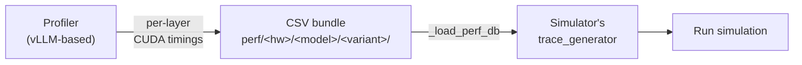

# Profiler

剖析器是一个**基于 vLLM 的逐层剖析器（layerwise profiler）**。它用合成批次驱动真实的 vLLM 引擎，并将逐层 CUDA 内核延迟记录到按类别划分的 CSV 文件中。这些 CSV 正是模拟器的 `trace_generator` 在运行时读取的内容——剖析器的输出就是模拟器的输入。

## 何时需要运行它

如果您的硬件 × 模型组合已经包含在随附的剖析数据中，则**不需要**运行剖析器。否则：

| 场景 | 需要剖析？ |
| --- | --- |
| 运行随附的 `(hardware, model)` 组合（例如 RTXPRO6000 + Llama-3.1-8B） | 否，直接模拟 |
| 随附模型搭配新 GPU（例如 H100、A100） | 是，参见[添加新硬件](./adding-hardware) |
| 随附 GPU 搭配新模型（`Mistral-7B`、`Phi-3.5-MoE`……） | 视情况，参见[添加模型架构](./adding-model-architecture) |
| 非 GPU 加速器（TPU、自定义 NPU） | 是，但工作流程不同，参见[添加非 GPU 硬件](./adding-hardware#adding-non-gpu-hardware) |

## 它产生什么

对于每个被剖析的 `(hardware, model, variant)` 组合，剖析器会在 `profiler/perf/<hardware>/<model>/<variant>/` 下写入一个文件夹，其中每个被剖析的张量并行（tensor parallel）度对应一个 `tp<N>/` 子文件夹：

```
perf/<hardware>/<model>/<variant>/
├── meta.yaml                       # engine flags, sweep specs, skew_fit summary
└── tp<N>/
    ├── dense.csv                   # token-count → latency
    ├── per_sequence.csv            # seq-count → latency
    ├── attention.csv               # 4D: (pc, kv_pre, n_dec, kv_dec) → latency
    ├── moe.csv                     # MoE only: (tokens, experts) → latency
    ├── skew.csv                    # raw heterogeneous-decode shots
    └── skew_fit.csv                # fitted per-bucket alpha table
```

时间以**微秒**存储（`time_us` 列）；模拟器在加载时乘以 1000 并四舍五入为纳秒。

Schema 细节参见 **[输出数据包](./output-bundle)**。

## 与整体架构的关系



剖析器运行在 **vLLM Docker 容器**上（或通过 `scripts/install-vllm.sh` 在裸机上运行）。模拟器运行在**模拟器容器**（`astrasim/tutorial-micro2024`）上。它们共享 `profiler/perf/` 目录，这是它们之间唯一交换的东西。

## 随附的剖析数据

| 硬件 | 模型 | 变体 | TP 度数 |
| --- | --- | --- | --- |
| `RTXPRO6000` | `meta-llama/Llama-3.1-8B` | `bf16` | 1, 2 |
| `RTXPRO6000` | `Qwen/Qwen3-32B` | `bf16` | 1, 2 |
| `RTXPRO6000` | `Qwen/Qwen3-30B-A3B-Instruct-2507` | `bf16` | 1, 2 |
| `RTX4090` | `meta-llama/Llama-3.1-8B` | `bf16` | 1 |

这就是全部：两个硬件目标、三个模型，**仅 `bf16`**，而且只有 RTXPRO6000 的数据包带有 TP=2。如果您的 `(hardware, model, variant, tp)` 组合在这个表中，您可以完全跳过剖析器；其他任何组合都需要一次剖析运行。RTX 4090 数据包由 [#59](https://github.com/casys-kaist/LLMServingSim/pull/59) 贡献，并且是唯一在所有指标上端到端验证在 1% 以内的数据包——参见 **[验证](../validation)**。

有两个后果常常让人踩坑：

- **没有随附 `-kvfp8` 数据包。** `--kv-cache-dtype fp8` 会解析到一个不存在的 `bf16-kvfp8` 变体文件夹，因此它会在启动时失败，直到您用 `KV_CACHE_DTYPE=fp8` 剖析它。参见 **[示例 → FP8 KV 缓存](../examples/memory-tiers/fp8-kv-cache)**。
- **TP=4 及以上需要一次剖析运行**，即使在 RTXPRO6000 上搭配随附模型也是如此，**RTX4090 上的 TP=2** 也一样——该数据包只有 TP=1。`_load_perf_db` 在缺少 `tp<N>/` 文件夹时会直接报错，而不是外推。

## 先决条件

- **vLLM Docker 容器**在 `/workspace` 运行（挂载仓库根目录）。参见 **[安装 → vLLM 设置](../getting-started/installation/vllm)**。
- **NVIDIA GPU**（仅剖析器需要，模拟器在 CPU 上运行）。
- 门控模型配置（Llama 3.x 等）需要 **`HF_TOKEN`** 环境变量。在启动前在 `scripts/docker-vllm.sh` 中设置。
- 为要剖析的模型变体预留**几 GB GPU 内存**（TP=1 需要完整模型；TP=N 需要 `model_size / N`）。

## 接下来去哪里

- **[运行](./running)**：编辑 profile.sh，为您的扫描选择选项，然后开始。
- **[输出数据包](./output-bundle)**：剖析器输出的每个 CSV 的 schema 参考。
- **[偏斜与 alpha 拟合](./skew-alpha-fit)**：异构解码修正如何被剖析与拟合。
- **[添加新硬件](./adding-hardware)**：GPU（vLLM 支持）或非 GPU（TPU、自定义加速器）。
- **[添加模型架构](./adding-model-architecture)**：何时编写新的架构 YAML，以及其中应包含什么。
