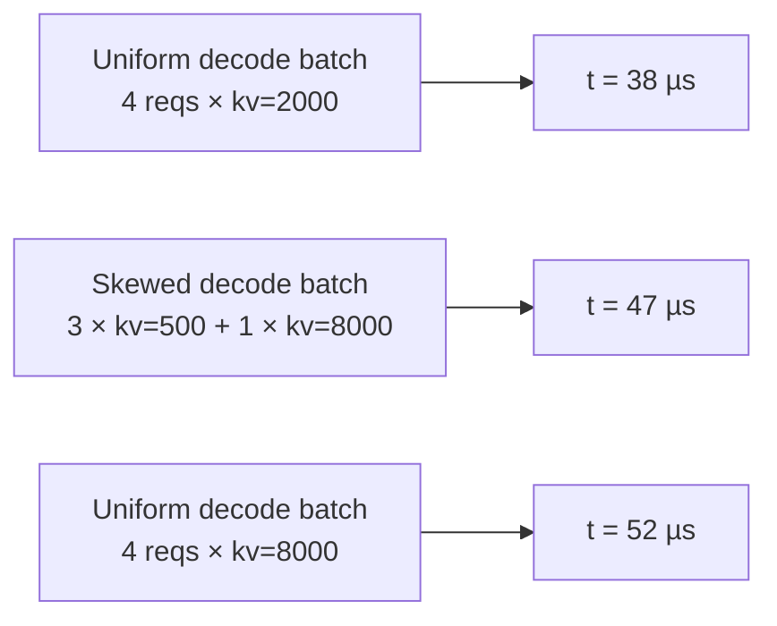

# 偏斜与 alpha 拟合

均匀注意力扫描（`attention.csv`）剖析的是所有解码共享一个 KV 长度的批次。真实服务不是这样的，每次迭代都会把处于高 KV 的长运行请求与刚到达的低 KV 请求混在一起。FlashAttention 的 varlen 内核会为这种异构性付出真实的代价（tile 填充 + SM 不均衡），而均匀网格看不到这一点。

偏斜扫描 + alpha 拟合就是模拟器做对这一代价的方式。

## 一张图说明问题



三个批次具有相同的 `n=4` 解码数和相同的 **mean** KV 2000（左和中）或 **max** KV 8000（中和右）。中间批次的延迟落在两个均匀参考点之间，但具体落在哪里，取决于 KV 分布的偏斜程度。

朴素的插值 `t = t(mean_kv)` 低估了偏斜情形（预测 38 µs 对实际 47 µs）。使用 `t(max_kv)` 会高估（52 µs 对 47 µs）。

## 解决办法：用按桶的 alpha 向第二次查找混合

对于每种偏斜批次形状，我们测量实际延迟**以及**相同形状下均匀-平均和均匀-最大延迟。每个采样点三个数字：

| 符号 | 批次形状 |
| --- | --- |
| `t_mean` | 相同 `n`，所有解码均匀处于批次的**平均** kv |
| `t_max` | 相同 `n`，所有解码均匀处于批次的**最大** kv |
| `t_skew` | 实际双峰混合：`nb` 个解码在 `kv_big` + `(n - nb)` 个解码在 `kvs` |

由这三个：

```
alpha = (t_skew - t_mean) / (t_max - t_mean)
```

Alpha 是 **t_mean → t_max 线上的归一化位置**：

- `alpha = 0` → 无惩罚；偏斜批次表现得像均匀-平均。
- `alpha = 1` → 完全惩罚；偏斜批次表现得像均匀-最大。

要求 `t_max > t_mean`，否则该行记录为 `nan`，拟合跳过它。

:::info[alpha 不夹取到 [0, 1]]
名字说"归一化"，但没有任何东西约束这个比值，而且测量数据经常落在 `[0, 1]` 之外。跨 `profiler/perf/` 的六个数据包，按 `skew.csv`：

| | 范围 |
| --- | --- |
| p50 | 0.07 – 0.13 |
| p90 | 0.46 – 0.96 |
| `alpha < 0` 的行 | 14 – 20 % |
| `alpha > 1` 的行 | 2 – 5 % |

两个尾部有不同的原因，只有一个属于噪声：

- **`alpha < 0`** 大多是端点间隙落在测量噪声之内。一次 `t_mean = 941.7 us`、`t_max = 946.6 us` 的采样在约 940 us 基线上有 4.9 us 的间隙，因此比 `t_mean` 低 10 us 的 `t_skew` 读作 `alpha = -2.16`。这个量级是用小数相除的产物；底层的信号是"没有可测量的惩罚"。
- **`alpha > 1` 是真实的。** 偏斜混合确实可能比*任一*均匀参考都更贵，因为 tile 填充和 SM 不均衡并不受均匀-最大情形的约束。Qwen3-32B TP=1 数据包中最大的一行是 `n=32, pc=2048, kv_big=16384, kvs=4096`，`t_mean = 19.1 ms`、`t_max = 19.3 ms`、`t_skew = 24.5 ms`——比均匀-最大高 5.2 ms，因此 `alpha = 19.4`。

拟合和 `_skew_alpha` 都不夹取该值，因此解析出大 alpha 的桶会按设计外推到 `t_max` 之外。按桶的加权-LS 拟合正是让噪声尾部不至于主导的方法：它把每个单元的多达许多采样汇集起来，因此孤立的 `-2.16` 行与其邻居平均，而不是直接使用。
:::

在模拟时，查找变成：

```
t_predicted = t_mean_lookup(batch.kv_decode_mean)
            + alpha(batch.shape) × (t_max_lookup(batch.kv_decode_max)
                                    - t_mean_lookup(batch.kv_decode_mean))
```

这就是 `serving/core/trace_generator.py` 中的 `_lookup_attention_with_skew`。它在平均解码 kv 处查找批次，并且只在非零 alpha 适用时向最大值处的第二次查找混合——否则按原样返回平均查找。

## 扫描结构（`skew.csv`）

偏斜扫描分两层产生 `skew.csv` 行：

### Tier 1，对 (n, ratio, pc, kp, kvs) 的全因子

在一个代表性偏斜因子（`_SKEW_REP = 4.0`）下的全因子扫描。提供大部分行，覆盖拟合所区分的每个 `(pc, n_bin, kv_big_bin, kp_bin, skew_rate_bin)` 单元。

按轴：

- `n` ∈ 直到 `MAX_NUM_SEQS` 的唯一值
- `ratio = nb / n` ∈ 少量采样分数
- `pc` ∈ 预填充块网格（包括 0 = 纯解码）
- `kp` ∈ 预填充历史网格
- `kvs` ∈ 小 kv 网格
- `skew` = 4.0（固定）

### Tier 2，锚点枢轴处的偏斜轴扫描

在少量锚点枢轴（Tier 1 单元的固定子集）处，Tier 2 扫描 `skew ∈ {1.5, 2.0, 4.0, 8.0, 16.0}`。这是唯一产生 `skew ≠ 4.0` 行的来源；覆盖了 alpha 在离群 KV 拉伸时如何饱和。

Tier 2 捕获了"超长上下文解码加入短上下文批次"这种 Tier 1 单独会错过的失败模式。

## 密度参数

五个轴都可以通过 `profile.sh` 中的逐轴几何因子控制（默认 `2.0` = 倍增）：

| 变量 | 轴 | 剖析时间影响 |
| --- | --- | --- |
| `SKEW_N_FACTOR` | `n` | 倍增使采样减半 |
| `SKEW_PC_FACTOR` | `pc` | 同上 |
| `SKEW_KP_FACTOR` | `kp` | 同上 |
| `SKEW_KVS_FACTOR` | `kvs` | 同上 |

偏斜扫描每个用例触发 **3 次采样**（`t_mean`、`t_max`、`t_skew`），因此稀疏化的影响迅速累积。把任何因子提高到 `4.0` 会使该轴的采样减少到四分之一；`8.0` 再减一次。

有效值落在 `meta.yaml::skew_profile.factors` 中。

## 拟合（`skew_fit.csv`）

原始 `skew.csv` 行太细粒度，无法在运行时查询——数百万个 alpha，没有一个与运行时批次形状完全匹配。后处理拟合将行沿五个轴分组为**桶**，并对每个桶运行加权最小二乘拟合。

### 5 轴桶键

| 轴 | 分桶方案 |
| --- | --- |
| `pc` | 每个唯一 `pc` 值一个桶（原始值） |
| `n_label` | 每个被剖析的 `n` 值一个桶，外加一个溢出桶：`n<=2`、`n<=4`、`n<=8`、`n<=16`、`n<=32`、`n<=64`、`n<=128`、`n<=256`、`n>256` |
| `skew_rate_label` | 归一化 [0, 1] 率上的固定分箱——这是唯一真正被夹取到该范围的轴：`sr<=5%`、`sr<=15%`、`sr<=40%`、`sr<=70%`、`sr>70%` |
| `kv_big_label` | log-4x 分箱扩展到观测到的最大值：`kvB<=1k`、`kvB<=4k`、`kvB<=16k`、`kvB>16k` |
| `kp_label` | 每个被剖析的 `kp` 值一个桶，带 `kp=0` 哨兵用于纯解码批次，外加溢出桶：`kp=0`、`kp<=512`、`kp<=1k`、`kp<=2k`、`kp<=4k`、`kp<=8k`、`kp>8k` |

这些是拟合器写入、模拟器重建的**字面字符串**，连接成 `pc={pc}|{n_label}|{sr_label}|{kvb_label}|{kp_label}`，因此它们必须逐字符匹配。上面的值来自 Qwen3-32B bf16 数据包；更宽的扫描产生更多 `n` 和 `kp` 桶并扩展 `kv_big` 分箱，这就是为什么模拟器从 `meta.yaml::skew_fit.bucket_axes` 读出它们而不是硬编码。

桶轴定义写入 `meta.yaml::skew_fit.bucket_axes`，以便模拟器在查找时构建相同的桶键。扩大剖析扫描会自动点亮更细的分辨率，无需修改模拟器代码。

### 存储

- `skew_fit.csv`：完整的按桶 alpha 映射。典型扫描约 1000–5000 行。
- `meta.yaml::skew_fit.per_tp[tp]`：每个 TP 的摘要：`method`、`n_samples`、`alpha_default`、`rel_err_p50/p90/p99`、`signed_mean`，外加指向 `tp<N>/skew_fit.csv` 的 `bucket_table` 指针。

这种拆分使 `meta.yaml` 每个变体保持在约 100 行而不是 3000+ 行。

### 随附剖析数据的拟合精度

RTXPRO6000 在随附模型上的扫描验证结果：

| TP | n_samples | rel_err_p50 | rel_err_p90 | rel_err_p99 |
| --- | --- | --- | --- | --- |
| TP=1 | ~13 k | 2.7% | 14.8% | 31% |
| TP=2 | ~12 k | 3.5% | 16.4% | 32% |

p50 和 p90 是拟合 alpha 相对保留采样中测量 alpha 的相对误差。这些数字与之前的 3 轴拟合在 p50 上无差别，但 p90 上好约 10%，因为 5 轴桶方案捕获了 Tier 2 浮现的 `(skew_rate, kv_big)` 交互。

## 跳过 / 刷新模式

| 变量 | 效果 |
| --- | --- |
| `SKIP_SKEW=1` | 跳过整个偏斜步骤。不产生 `skew.csv` 或 `skew_fit.csv`。模拟器随后应用**无偏斜修正**（`alpha = 0`） |
| `ONLY_SKEW=1` | 只运行偏斜步骤，不动 `dense / per_seq / attention / moe`。在轴密度变化后刷新偏斜时很有用 |

完全没有拟合时，模拟器使用 `alpha = 0`，即直接来自均匀网格的 `t_mean`。这会使异构解码注意力的预测低几个百分点，对首次粗略检查通常没问题。它刻意不是从其他硬件借来的常数。在拟合内部，没有采样的桶确实会回退到该拟合自身的汇集 `alpha_default`，在同一 GPU 上测量。

## Gotchas

1. **`skew_fit.csv` 按桶键控**，而不是按原始形状键控。没有匹配桶的运行时批次回退到 `alpha_default`。如果您的负载把形状推到剖析网格之外，预期 `alpha_default` 会主导，用更宽的网格边界重新剖析。
2. **`alpha < 0` 或 `alpha > 1` 在拟合时被忽略。** 测量噪声偶尔会从单个采样产生超出范围的原始 alpha；拟合忽略它们。
3. **偏斜修正只对非平凡批次触发。** 纯预填充（`n_decode == 0`）和纯均匀解码批次不需要修正，均匀网格已经正确。
4. **MoE 不做偏斜修正。** 模拟器的偏斜路径是注意力专属的。MoE 每 rank 延迟直接从 2D `(tokens, activated_experts)` 表读取。

## 接下来

- **[输出数据包 → `skew_fit.csv`](./output-bundle#skew_fitcsv-skew-enabled-runs)**：逐列参考。
- **[模拟器 → 轨迹生成](../simulator/trace-generation#heterogeneous-decode-skew-correction)**：alpha 在模拟时如何应用。
