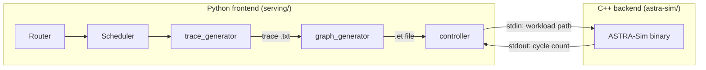
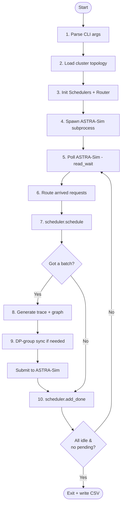
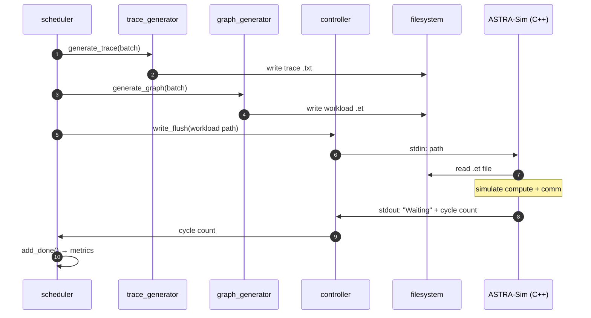

# 架构概览

LLMServingSim 由两部分拼接而成：一个 **Python 服务前端**（`serving/`），负责请求调度、批处理和轨迹生成；以及一个 **C++ 分析后端**（[ASTRA-Sim](https://github.com/astra-sim/astra-sim)），在可配置网络上模拟计算与集合通信。

Python 侧是编排者。C++ 侧是周期计数引擎，为每个批次返回经过的时间。

> 本页是"工作原理"概览。如果你想了解"如何配置"，请参阅 **[示例](../examples)**。

## 两半

| 层次 | 所在位置 | 交流语言 | 负责内容 |
| --- | --- | --- | --- |
| **Python 前端** | `serving/` | 请求、批次、轨迹 | 调度、前缀缓存、内存记账、轨迹生成 |
| **C++ 后端** | `astra-sim/` | Chakra `.et` 图、周期计数 | 计算内核计时、集合通信建模、网络拓扑 |

它们通过单条子进程管道和一个极简字符串协议通信，参见下方 [Python ↔ C++ 边界](#python--c-boundary)。

## 10 步主循环

`serving/__main__.py` 驱动模拟。循环的每次迭代都将模拟时钟向前推进下一个批次所需的纳秒数：

1. **解析 CLI 参数**：集群配置路径、批处理参数、路由/专家策略、特性开关（`--enable-prefix-caching`、`--enable-attn-offloading` 等）。
2. **通过 `config_builder` 加载集群拓扑**：提取 `num_nodes`、实例布局、NPU↔实例映射，生成 ASTRA-Sim 输入文件（`network.yml`、`system.json`、`memory_expansion.json`）。
3. **初始化每个实例的调度器（Scheduler）和全局路由器（Router）。** 可选地从数据集中加载请求。
4. **启动 ASTRA-Sim 子进程**（分析或 ns3 后端）。
5. **轮询 ASTRA-Sim**：`controller.read_wait()` 阻塞直到子进程报告 `Waiting`，表示某个 NPU 上的一次迭代已完成。
6. **路由任何新到达的请求** —— `router.route_arrived_requests(current)` 将 `arrival_time_ns <= current` 的请求移入相应的调度器队列。
7. **调度下一个批次** —— `scheduler.schedule(current, sys)` 返回一个 `Batch`（如果没有可运行的则返回 `None`）。
8. **如果得到批次**：生成逐层计算轨迹（`trace_generator.generate_trace`），转换为 Chakra 图（`graph_generator.generate_graph`），并将图路径推送给 ASTRA-Sim（`controller.write_flush`）。
9. **DP 组同步** *（可选）*：同一 `dp_group` 中的实例推迟轨迹生成，直到**所有**组成员都已为本次迭代完成调度，然后以同步的 ALLTOALL `comm_size` 一起提交。
10. **标记请求完成**，当 ASTRA-Sim 通过 `scheduler.add_done(...)` 报告完成时。当每个实例都空闲且没有待处理或延迟的请求时，循环退出。

时钟变量是 `current`（单位**纳秒**）；只在输出时转换为秒。周期计数来自 ASTRA-Sim，每次迭代加到 `current` 上。

## 模块地图

Python 前端在 `serving/core/` 下拆分为功能聚焦的模块。每个都是本节中一个专属页面的主题：

| 模块 | 职责 | 了解更多 |
| --- | --- | --- |
| `request.py` | `Request` 和 `Batch` 数据类 | [请求生命周期](./request-lifecycle) |
| `router.py` | 跨实例路由、agentic 依赖链 | [请求生命周期](./request-lifecycle) |
| `scheduler.py` | 每实例 vLLM 风格连续批处理 | [连续批处理](./scheduling/continuous-batching) |
| `block_pool.py` | 分层 KV 块池 + 前缀缓存索引 | [前缀缓存](./scheduling/prefix-caching) |
| `kv_cache_manager.py` | 分层 KV 缓存管理器（块哈希、分配） | [前缀缓存](./scheduling/prefix-caching) |
| `memory_model.py` | KV 缓存与权重内存记账 | [KV 缓存与内存](./scheduling/kv-cache-and-memory) |
| `trace_generator.py` | 根据 profile CSV 生成逐层轨迹 | [轨迹生成](./trace-generation) |
| `graph_generator.py` | Chakra `.et` 发射器 | [轨迹生成](./trace-generation) |
| `gate_function.py` | MoE 专家路由 | [MoE 专家路由](./moe-expert-routing) |
| `pim_model.py` | PIM 设备延迟模型 | [PIM 卸载](./specialized/pim-offload) |
| `power_model.py` | 功耗与能量记账 | [功耗模型](./specialized/power-model) |
| `controller.py` | ASTRA-Sim 子进程 IPC | [下方](#python--c-boundary) |
| `config_builder.py` | 集群配置 → ASTRA-Sim 输入文件 | [示例 → 集群配置详解](../examples/cluster-config-explained) |

## Python ↔ C++ 边界

恰好有**一个**跨语言边界：`controller.py` 与 ASTRA-Sim 二进制之间的子进程管道。

具体来说：

1. Python 调度器决定本次迭代运行哪些请求，并生成一个 `Batch`。
2. `trace_generator` 以字段元组构建逐层轨迹。使用 `--save-trace-text` 时，也会写入 `astra-sim/inputs/runs/<run_id>/trace/<hw>/<model>/instance_{i}_batch_{b}.txt` 供检查；管道中没有任何东西读取该文件。
3. `graph_generator` 将这些行交给在进程中运行的 Chakra 转换器，生成 protobuf 图，位于 `astra-sim/inputs/runs/<run_id>/workload/<hw>/<model>/instance_{i}_batch_{b}/llm.et`。与已转换过的轨迹相同的轨迹会复用其图。
4. `controller.write_flush(process, "<workload-path>")` 通过 stdin 发送该路径。
5. ASTRA-Sim 读取 `.et` 文件，执行计算 + 通信图，在 stdout 打印 `Waiting <sys=<npu>> id=<batch> cycle=<ns>`。
6. `controller.read_wait` 解析该行；主循环将周期计数交给 `scheduler.add_done` 以更新请求指标。

该协议在 Python → C++ 方向上有少量命令：

- 一个工作负载路径，开始运行该批次。
- `pass`：没有可运行的。ASTRA-Sim 停止再次询问该 NPU，直到某些事情可能改变答案——某个 NPU 报告了前端尚未处理的一次迭代，或分配了工作负载。
- `pass <tick>`：同上，外加下一个已知的请求到达时间。这是后端无法自行推算的唯一信息；没有它，空闲实例会在本该接纳的到达时间过去后继续保持安静，而此时所有其他实例都在批次中。
- `pass -1`：这个 `pass` *改变了*调度器状态，因此它不是幂等的——三次 DP 屏障 pass 就是如此（以 dummy 批次加入一轮、以真实批次加入一轮、交回批次认领）。处理方式与工作负载分配完全相同：重新打开每个 NPU。
- `done`：该实例空闲。
- `exit`：关闭。

前端和二进制必须匹配，因为旧版二进制会将答案与 `"pass"` 精确比较，并会把 `pass 12345` 读成工作负载路径。修改任何一侧后需要重新构建。

没有共享内存、没有回调 API、没有 FFI，只有文件和文本协议。只要转换器已知的轨迹字段足够，在 Python 侧添加新特性通常不需要改动 C++（参见 [参考 → 轨迹文件格式](../reference/trace-format)）。

## 共享了哪些状态，以及它们在哪里

有少数跨模块的状态值得了解，因为它们会出现在多个页面中：

- **`Router._pending_requests`**：从数据集加载但 `arrival_time_ns` 还在未来的请求。按到达时间排序。
- **`Router._deferred_sessions`**：等待工具调用结束才能释放下一个子请求的 agentic 会话。
- **`Scheduler.memory: MemoryModel`**：每实例 NPU + CPU 内存追踪器，包括每实例的 NPU 前缀缓存。
- **共享 CPU/CXL `BlockPool`**：第二层前缀池。可选（`--enable-prefix-sharing`）；启用后，节点上的所有实例共享一棵树。
- **`dp_pending`（在 `__main__.py` 中）**：每个 DP 组的屏障字典，用于协调波同步的轨迹提交。

每一项都在拥有它的页面中解释；这个列表只是让你在交叉引用时有一张地图。

## 下一步去哪里

如果你想跟随单个请求从 JSONL 一路走到输出 CSV，请阅读 **[请求生命周期](./request-lifecycle)**。它走与上面相同的主循环，但从请求的视角出发，并给出具体的代码路径。

如果你想专门理解调度器的工作、分块预填充、"带前缀调度"与"基础调度"的区别、PP 流水线深度，请前往 **[连续批处理](./scheduling/continuous-batching)**。
