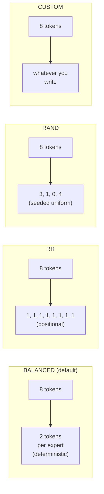

# MoE 专家路由

对于混合专家模型，每个访问 MoE 层的 token 都需要回答两个问题：**我激活哪些专家**以及**它们由哪个 EP rank 持有**。第一个是模型的门控函数；第二个由模拟器如何把专家分配给 rank 决定。本页讲两者。

> 配置角度（`--expert-routing-policy` flag、何时用哪种）在 **[示例 → Expert parallel](../examples/parallelism/expert-parallel)**。本页是内部机制。

## 干这活的组件：`GateRouter`

`serving/core/gate_function.py` 定义了 `GateRouter`。轨迹生成器为每次模拟实例化一个；在每一个 MoE 块上调用：

```python
GateRouter(
    num_local_experts=N,           # total experts in the model
    num_experts_per_token=K,       # top-K activations per token
    routing_policy='BALANCED',     # one of 4 policies, see below
    seed=42,
    block_copy=True,
)

result = router.route(num_tokens=T, tp_rank=r, num_experts_per_token=K)
# → RoutingResult(local_tokens=[...], activated_experts=[...], source_tokens=[...])
```

`local_tokens[i]` 是 dispatch 后分配给 EP rank `i` 的 token 数。`activated_experts[i]` 是该 rank 上触及的不同专家数。两者都输入按 rank 的注意力/MLP 延迟查找。

## 四种策略



| 策略 | 确定性 | 建模什么 | 何时使用 |
| --- | --- | --- | --- |
| **BALANCED**（默认） | 确定性 | 理想化的负载均衡门控（辅助损失训练后） | 大多数研究基线 |
| **RR** | 确定性 | 纯轮询分配 | 健全性 / 空基线运行 |
| **RAND** | 种子随机 | 每个 token 均匀随机 | 最坏情况负载不均衡研究 |
| **CUSTOM** | 插件式 | 你写的任何东西 | 真实训练好的门控权重、消融实验 |

### BALANCED，闭式鸽笼

BALANCED 计算一个完美负载均衡的门控会产生的*精确* token 分布：对 `T` 个 token 和 `E` 个专家、top-`K`，每个专家得到 `T*K/E` 个 token（余数确定性地在专家间分配以取整为整数）。

这就是带训练良好的辅助负载均衡损失的模型在期望上收敛到的结果。它是模拟器的默认值，因为：

1. 真实生产 MoE 部署使用辅助损失 → 均衡分布是现实基线。
2. 它是确定性的，因此模拟可复现。
3. 它启用**块复制**优化（见下文）。

### RR，轮询

Token *t* 去专家 `t % num_local_experts`。每次前向都是同一个专家，与 token 内容无关。适合作为健全性检查，或当你想要一个"无智能路由"基线时；期望上产生与 BALANCED 相同的按 rank token 数。

### RAND，随机

每个 token 在专家间均匀随机（默认用 `seed=42` 保证可复现）。产生现实的最坏情况负载不均衡——某些 rank 看到的 token 比其他的多，这正是*未训练*门控产生的。如果你想专门研究负载不均衡的成本，用它。

### CUSTOM，插件式

编辑 `gate_function.py::GateRouter._custom_routing`。该钩子接收 token 列表并返回每个 token 的专家分配。如果你想用真实训练好的门控权重或从轨迹学习到的模型来驱动路由，用它。

## 专家到 rank 的分配

无论哪种策略决定"token T 去专家 E"，模拟器还必须知道"专家 E 在哪个 rank 上"。这使用**均匀划分**：

```
GateFunction.expert_owner(e, ep_size, num_experts)
    = min(e * ep_size // num_experts, ep_size - 1)
```

因此 128 个专家、`ep_size=2` 时，专家 0–63 在 rank 0 上，64–127 在 rank 1 上。`ep_size=4` 时每个 rank 持有 32 个专家。`min(..., ep_size - 1)` 是防御性的——对合法的专家 id，除法结果已经落在 `ep_size` 之下——但它防止越界 id 索引超过最后一个 rank。

`GateRouter.route()` 的输出将逐 token 的分配折叠成按 rank 的 token 数，ASTRA-Sim 通过轨迹的 `EXPERT {i}` 标记消费。

## `block_copy`：它意味着什么，何时安全

默认 `block_copy=True`。轨迹生成器只为**第一个 transformer 块**发出完整轨迹，并通过单个 `block_copy` Chakra 指令在所有块间重放。

这对以下情况是**安全**的：

- 稠密模型（没有 MoE，所有块相同）。
- 带 `BALANCED` 的 MoE（每个块路由方式相同，因为 BALANCED 是确定性的且无状态的）。

对以下情况是**近似**：

- 带 `RR` 的 MoE（轮询位置逐层交替，实践中按 rank 的计数仍然几乎相同）。
- 带 `RAND` 的 MoE（逐块随机性产生的方差是复制无法捕捉的）。
- 带 `CUSTOM` 的 MoE（完全取决于你写了什么）。

对于逐块方差重要的研究，请在轨迹生成器中设置 `enable_block_copy=False`（或选择 block_copy 自动禁用的策略）。模拟运行得更慢，但生成逐块轨迹。

## 按 rank 的延迟查找

每个 rank 的 MoE 块延迟来自 `profiler/perf/<hw>/<model>/<variant>/tp1/moe.csv`，键为：

| 键 | 含义 |
| --- | --- |
| `local_tokens` | dispatch 后分配给该 rank 的 token |
| `activated_experts` | 该 rank 触及的*不同*专家数 |

在 TP=1 下剖析（MoE 中没有张量切分，每个专家的权重已经很小）。模拟器跨两个轴做二维线性插值。

完整的 MoE 块延迟然后是 **max(rank_latencies)**，因为 rank 并行执行并在 ALLTOALL 屏障处同步。无论哪个 rank 得到最多的 token × 专家，都由它主导。

## ALLTOALL 成本如何围绕 MoE 块

轨迹中的每个 MoE 块都被夹在两个 ALLTOALL 集合通信之间：

```
input_residue → dispatch ALLTOALL → expert compute → combine ALLTOALL → output_residue
```

- **Dispatch ALLTOALL**：将输入激活从每个 rank 的 TP 分片路由到持有其分配专家的 rank。
- **Combine ALLTOALL**：将专家输出收集回发起 rank。

两者都有 `comm_size = total_len * hidden_size * fp_size`（完整激活张量；ASTRA-Sim 按 rank 做除法）。

对于 **DP+EP** 拓扑，`comm_size` 同步到 DP 组内的最大值，参见 **[并行机制](./parallelism-mechanics)**。

## 注意事项

1. **`block_copy` 默认 True**，并且对非 BALANCED 策略静默地产生近似。如果你专门研究负载不均衡，请禁用它。
2. **`activated_experts` 是按 rank 的，不是按 token 的。** 一个 100 个 token 命中 8 个不同专家的 rank 报告 `activated_experts = 8`，而不是 800。延迟查找期望这个约定。
3. **MoE 在 TP=1 下剖析。** 增大 `tp_size` 不会改变 MoE CSV 路径。专家权重的切分通过 `ep_size` 发生，模拟器通过调整 rank 到专家的映射来处理，而不是重新剖析。
4. **`num_experts_per_tok`（top-K）** 从模型的 HF 配置读取。模拟时偏离训练值是可以的，但不会匹配真实模型的行为。
5. **DP 组中的哑批次仍然经过门控。** 1-token 哑批次与真实批次完全一样地经过路由，因此 DP+EP 结果在各波之间保持一致。

## 下一步

- **[并行机制](./parallelism-mechanics)**：MoE 块周围的 ALLTOALL 在网络层看起来什么样。
- **[示例 → Expert parallel](../examples/parallelism/expert-parallel)** — 配置角度（何时使用哪个 `ep_size`）。
- **[示例 → DP+EP MoE](../examples/parallelism/dp-ep-moe)** — 多实例 MoE。
