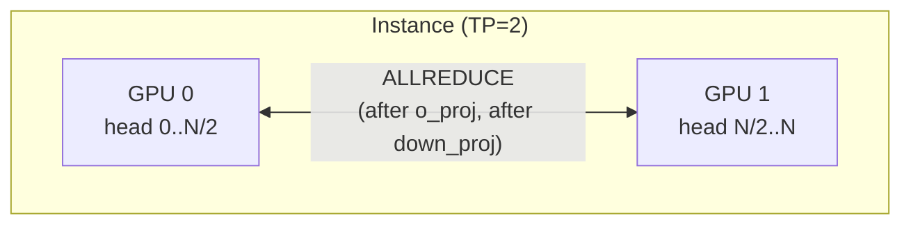
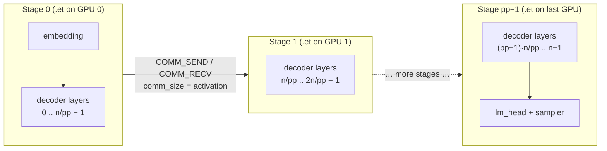
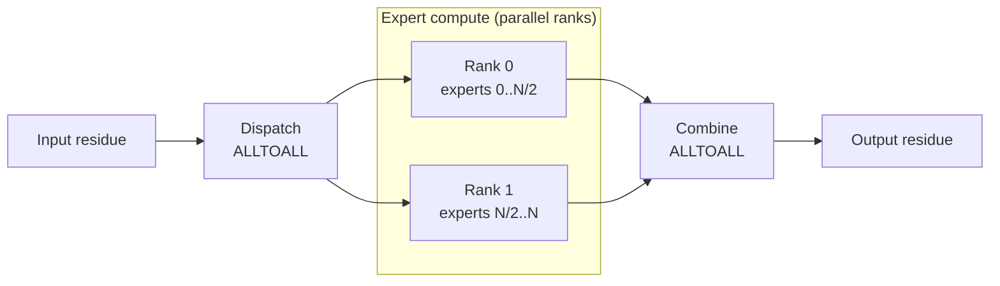
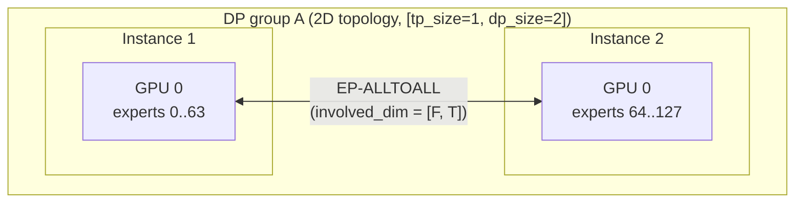
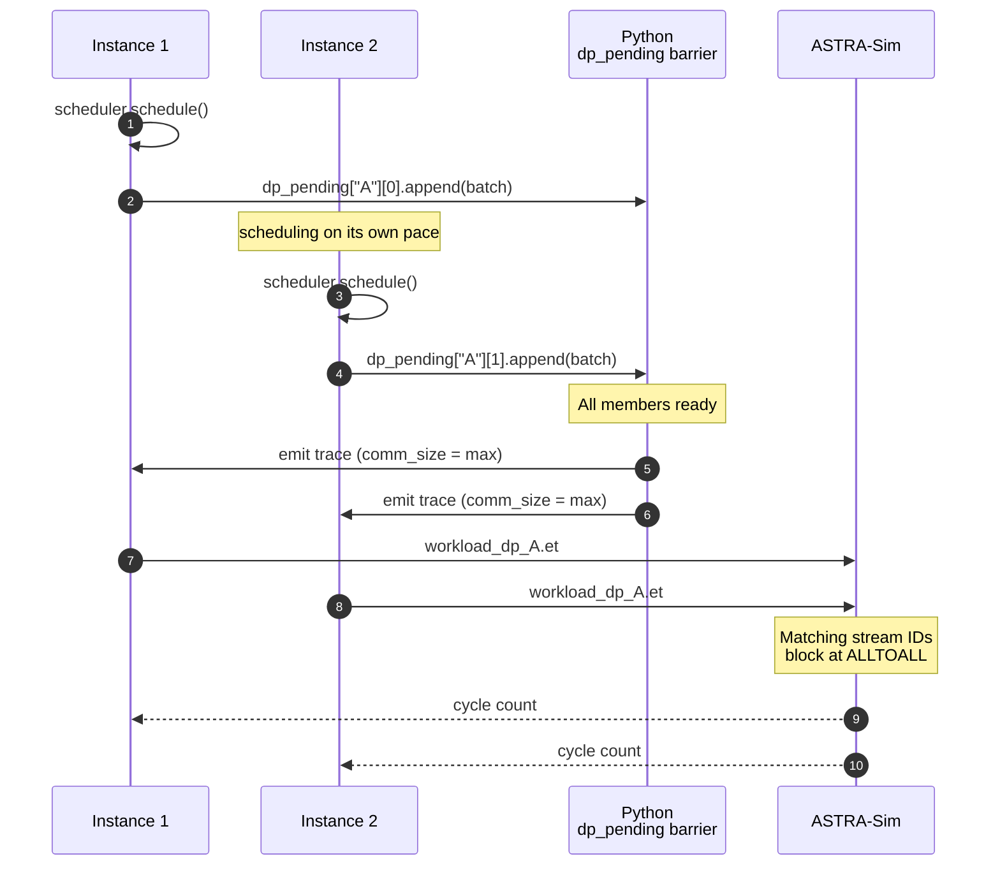

# 并行机制

本页是并行性的**运行时**侧：当一个批次到达 ASTRA-Sim 时，哪些集合通信会触发、在哪里触发，以及多实例 DP 组如何同步。集群配置角度（哪些字段开启这些）在 **[示例 → Cluster config explained](../examples/cluster-config-explained)**。

## 模拟器能建模什么

| 类型 | 并行化什么 | 集合通信 | 在哪里触发 |
| --- | --- | --- | --- |
| **TP**（张量） | 线性权重沿 head 维切分 | ALLREDUCE | `o_proj` 和 `down_proj` 之后 |
| **PP**（流水线） | 解码器层跨 GPU 组切分 | （`inflight` 队列中的点对点） | 阶段边界处 |
| **EP**（专家） | MoE 专家跨 rank 切分 | ALLTOALL | MoE 块周围 |
| **DP+EP** | EP 跨多个实例 | ALLTOALL | 相同，但跨实例边界并带波同步 |

TP 和 EP 可以共享同一批 GPU。DP 需要在集群配置上有 `dp_group` 标识——对稠密模型来说就是普通的数据并行，对 MoE 来说它还让专家跨组铺开。

## TP，每个稠密层上的 ALLREDUCE



当 `tp_size > 1` 时，轨迹生成器在每个 TP 感知的稠密线性层后附加一个 ALLREDUCE `COMM_COLL_NODE`：

- `o_proj`（注意力输出投影）
- `down_proj`（MLP 输出投影）

这两个层正是每个 TP rank 持有输出不同 head 切片、需要在 rank 间求和的地方。

每个 ALLREDUCE 的 `comm_size` 是完整的输出张量大小（不是每 rank 的，ASTRA-Sim 基于 `nodes_in_ring` 在内部做除法）。

`qkv_proj`、`gate_up_proj` 等不需要 ALLREDUCE，因为它们沿 head 维*切分*输入，这些层的输出已经为下一层正确分片。TP 的集合通信成本由 `o_proj` + `down_proj` 决定，每个解码器块两个 ALLREDUCE。

## PP，流水线阶段和 `inflight`



当 `pp_size > 1` 时，调度器维护一个上限为 `pp_size` 条目的 `inflight` 列表。当流水线满时，`schedule()` 返回 `None` 并等待 ASTRA-Sim 排空一个阶段，与 Megatron 风格 1F1B 相同的背压模式。

轨迹头带有 `model_parallel_NPU_group: {pp_size}` 以及 `pp_stage_boundaries`——每个后续阶段开始的层行索引。`trace_generator.py` 根据它刚写出的 transformer 块起点计算这些，使用与 vLLM `get_pp_indices` 相同的划分规则：块均匀切分，任何余数归*最后一个之前的*阶段，因为最后阶段还承载 `final_layernorm` / `lm_head` / `sampler`。Chakra 的 `llm_converter.py` 读取边界并为每块 NPU 发出一个 `.et`。在每个阶段边界，它将上游 NPU 上的 `COMM_SEND_NODE` 与下游 NPU 上匹配的 `COMM_RECV_NODE` 配对，大小由边界激活张量决定。

阶段**只能**在 transformer 块边界上切割。那是唯一一处上游层的 `output_size` 与下游层的 `input_size` 是同一个张量的地方——隐藏状态，因为块运行 `layernorm` → … → `down_proj`/`moe`。块内部它们不同（`qkv_proj` 输出 Q+K+V，`rotary_emb` 只声明 Q+K），而 ASTRA-Sim 的分析后端以 `(tag, src, dst, chunk_size, chunk_id)` 作为其 send/recv 回调跟踪器的键——因此大小不一致永远不会匹配，下游 NPU 会永远等待而不是报错。平均切分原始行数曾经会让边界落在块中间，这正是只有部分 `pp_size` 值会挂起的原因。

`--enable-sub-batch-interleaving` 在 `pp_size > 1` 时会被拒绝：交错轨迹会在每个组边缘让两个子批次都停在块中间，因此阶段没有单一的隐藏状态可以传递。

因此阶段间 P2P 延迟（链路带宽、跳数、竞争）是报告的迭代时间的一部分，而在途批次之间的流水线重叠则从每块 NPU 独立的 `.et` 调度中自然产生。

## EP，MoE 块周围的 ALLTOALL



对于 MoE 模型，`trace_generator` 用两个 ALLTOALL 集合通信包住 MoE 块：

```
... → MoE dispatch ALLTOALL → expert compute → MoE combine ALLTOALL → ...
```

dispatch ALLTOALL 将每个 token 路由到其分配专家的 rank。combine ALLTOALL 将专家输出收集回发起 rank。两者都限定在 EP 维上。

每个 EP rank 从 `profiler/perf/<hw>/<model>/<variant>/tp1/moe.csv` 获得一个按 rank 的延迟，键为其**本地** token 数（dispatch 之后）和每 token 的**激活专家**数。Rank 并行执行并在 ALLTOALL 屏障处同步，较慢的 rank 门控其他 rank。

Token 路由决策来自 `gate_function.py`。策略见 **[MoE 专家路由](./moe-expert-routing)**。

## DP+EP，波同步





这就是模拟器变聪明的地方。当两个或更多实例共享一个 `dp_group` 时，它们形成一个协调的波。两种同步机制协同工作：

### 1. Python 侧的 `dp_pending` 屏障

在 `__main__.py` 中，`dp_pending` 为每个 DP 组成员保存一个**队列**，存放等待其波的批次。轨迹生成被**推迟**，直到每个成员至少有一个批次入队；波然后从每个成员取最旧的一个，因此一个波总是配对成员们的第 *j* 个批次——与生产服务的配对相同，DP rank A 的第 *j* 次前向与 rank B 的第 *j* 次加入同一个集合通信。队列在 `pp_size > 1` 时很重要，此时一个成员可以同时有多达 `pp_size` 个批次未完成。当一个波组装时：

- 模拟器取组内 `max_total_len`，并把每个成员的批次填充到该值，匹配生产服务中的 CUDA graph DP 填充。
- MoE 集合通信大小锚定到同一个 `max_total_len`——*不是* `max x dp_group_size`。这样用同一个已经匹配 AllReduce 的 `link_bw` 校准 AllGather/ReduceScatter 带宽模型。
- 所有成员以相同的 `comm_size` 生成轨迹，即使它们的按实例 `total_len` 不同。

如果某个 DP 成员没有待处理请求，调度器合成一个**哑批次**（1 个 decode token）让波仍然运行。当一个成员的所有真实请求都完成而其他成员还没完成时，哑批次会持续流动直到整个组完成。

一个波的图无法在调度时发出——填充后的 `max_total_len` 要到屏障组装时才知道——因此每个成员的图在打开该轮的 NPU 的下一次轮询时交给它，优先于调度器本来会启动的任何东西。这让每块 NPU 按打开的顺序运行其批次，这正是完成记账所假定的。

### 2. ASTRA-Sim ALLTOALL 屏障

所有 DP 组实例的 `.et` 文件共享同一个工作负载文件夹（`dp_<group>_batch<bid>/llm.et`），并在 ALLTOALL 集合通信上使用**匹配的流 ID**。ASTRA-Sim 运行时看到匹配的 ID 就会阻塞，直到两块 NPU 都到达该集合通信，在网络层自然实现波同步。

因此同步的两半——提交时的 Python 推迟、集合通信上的 ASTRA-Sim 阻塞——共同产生确定性的波同步调度。

## 多维 ASTRA-Sim 拓扑和 `involved_dim`

存在 DP 组时，`config_builder` 生成多维 ASTRA-Sim 网络，最内层维在前：`npus_count: [tp_size, dp_group_size]`，或 `pp_size > 1` 时的 `[tp_size, pp_size, dp_group_size]`。这镜像 vLLM 的 rank 布局 `all_ranks.reshape(-1, dp, pp, pcp, tp)`；`pp_size` 维在它为 1 时省略，因此 DP+TP 配置保持二维拓扑。集合通信通过每个 `COMM_COLL_NODE` 上的 `involved_dim` BoolList 按维限定：

- **TP-ALLREDUCE：** 只有 TP 维——`[True, False]`，或带 PP 的 `[True, False, False]`。
- **EP：** DP 维，加上 EP 跨过一个实例的 GPU 时的 TP 维——`[False, True]` / `[True, True]`，或带 PP 的 `[False, False, True]` / `[True, False, True]`。PP 维**从不**参与：vLLM 的 EP 组是 `all_ranks.transpose(1, 2).reshape(-1, dp*pcp*tp)`，其转置固定了流水线阶段，因此专家在一个阶段的 DP x TP rank 间分片。

`involved_dim` 编码在轨迹的 `comm_type` 字段中，带 `:dim0,dim1` 后缀：

```
ALLREDUCE:1,0     # TP only
ALLTOALL:0,1      # EP across DP only
```

Chakra 转换器通过 `_parse_comm_type` 解析它，并把 BoolList 写入 `.et` 文件。ASTRA-Sim 的 `Workload::issue_comm` 读取它，只在涉及的维上派发集合通信。

`system.json` 的集合通信实现每个拓扑维需要一个条目，`config_builder` 自动生成：二维的 `"all-to-all-implementation": ["ring", "ring"]`。

## 通信大小（ASTRA-Sim 语义）

轨迹中的每个 `comm_size` 都是**总**数据大小，而不是每 NPU 的。ASTRA-Sim 在内部按环中节点数做除法（`msg_size = data_size / nodes_in_ring`）。

因此：

- `o_proj` 上的 ALLREDUCE：传**完整输出张量大小**（`total_len * hidden_size * fp_size`）。
- MoE 的 ALLTOALL：传**完整激活张量大小**（`total_len * hidden_size * fp_size`）。

如果你在轨迹日志中看到快得惊人的集合通信，检查你是否不小心传了每 rank 的大小，这是扩展轨迹生成器时常犯的错误。

## 何时使用哪种

粗略的决策树（*配置*角度在 [示例 → Cluster config explained](../examples/cluster-config-explained)）：

- **单 GPU 放得下模型：** TP=1。完事。
- **需要更多 GPU 来装内存：** 从 TP 开始。ALLREDUCE 成本随 `tp_size` 增长，超过 4-8 很少值得。
- **多个副本提升吞吐量：** 添加 `num_instances`（不带 `dp_group`）。路由器后面独立的实例。
- **MoE 模型，单实例：** 设置 `ep_size = tp_size`。同一批 GPU，EP-ALLTOALL 在 MoE 块上取代 TP-ALLREDUCE。
- **MoE，想把专家扩展到超过一个实例的 GPU：** 设置 `dp_group` 的 DP+EP。EP 通过波同步跨实例。
- **稠密模型，想要数据并行副本：** 设置 `dp_group` 且不带 `ep_size`。副本是波同步的，但不共享专家。

## 注意事项

1. **`ep_size > tp_size` 需要 `dp_group`。** 否则集群配置构建器会拒绝该规格。EP 需要拓扑的 DP 维才能扩展到超过单个实例的 GPU 数。
2. **哑批次是真实的 ASTRA-Sim 工作。** 有一个空闲实例的 DP 组仍然要在哑批次上支付 ALLTOALL 成本。生产就是这样，波同步就是波同步。
3. **`comm_size` 同步到最大值。** 即使某个 DP 成员的批次小得多，ALLTOALL 消息大小也匹配最大成员的。这是*正确的*（匹配生产填充），但值得知道。
4. **PP 模型通过 send/recv 转发阶段间数据，而不是在迭代内拆分微批次。** 阶段间的激活传输走 ASTRA-Sim 的 send/recv（因此链路带宽和竞争会出现在结果中），但单次迭代不会切成多个微批次——重叠收益来自同时运行多达 `pp_size` 个连续迭代。也没有旋钮可以选择流水线调度（1F1B、交错等）。

## 下一步

- **[MoE 专家路由](./moe-expert-routing)**：token 如何在 dispatch ALLTOALL 之前分布到 EP rank。
- **[示例 → DP+EP MoE](../examples/parallelism/dp-ep-moe)** — 一个跑通整套机制的工作配置。
