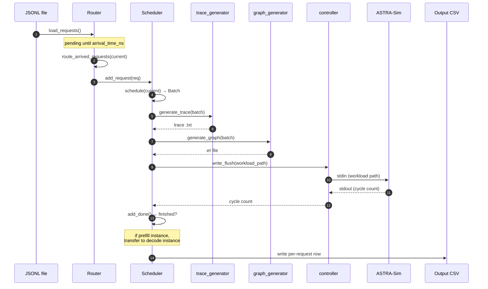

# 请求生命周期

本页跟随单个请求从 JSONL 文件一路走到输出 CSV 中的对应行。与 [架构概览](./architecture) 相同的主循环，但从请求的视角出发。

> 需要*配置*角度的内容（如何启用每个特性）？请参阅 **[示例](../examples)**。



## 阶段 1，加载到路由器

当 `python -m serving --dataset workloads/foo.jsonl` 启动时，`router.load_requests()` 逐行解析 JSONL 并构建 `Request` 对象：

```python
class Request:
    id: int
    model: str
    arrival_time_ns: int
    input_tokens: int        # prompt length
    output_tokens: int       # max decode length
    instance_id: int | None  # set on routing
    pd_type: str | None      # "prefill" or "decode" once routed
    session_id: str | None   # for agentic sessions
    sub_request_index: int   # 0 for flat, increments for sub-requests
    input_tok_ids: list[int] | None   # for prefix caching
    # ...metrics filled in later: ttft_ns, first_token_time_ns, etc.
```

同一文件中支持两种格式：

- **扁平（Flat）：** 一条 JSONL 条目 = 一个独立请求。
- **Agentic 会话：** 一条 JSONL 条目 = 一个包含多个链式子请求的会话。只有第一个子请求入队；其余存放在 `Router._deferred_sessions` 中，直到被释放。

`arrival_time_ns > 0` 的请求**不会**立即路由，它们进入 `Router._pending_requests`，按到达时间排序。

## 阶段 2，等待到达时间

模拟时钟（`__main__.py` 中的 `current`，单位 ns）随 ASTRA-Sim 返回周期计数而前进。一旦 `current >= request.arrival_time_ns`，`router.route_arrived_requests(current)` 将请求从 `_pending_requests` 中取出。

如果所有实例都空闲但有请求在未来到达，`__main__.py` 会将 `current` 直接推进到下一个到达时间，以避免忙循环。

## 阶段 3，路由到实例

路由器应用其策略（`--request-routing-policy`）：

| 策略 | 行为 |
| --- | --- |
| `LOAD`（默认） | vLLM 风格：选择 `waiting * 4 + running` 分数最小的实例 |
| `RR` | 纯轮询 |
| `RAND` | 均匀随机 |
| `CUSTOM` | 可在 `serving/core/router.py` 中插拔 |

对于**预填充/解码分离**，路由器在此阶段只考虑预填充实例。解码实例稍后通过 `transfer_prefill_request` 接收请求。

路由后，请求进入所选 `Scheduler` 的等待队列（`scheduler.add_request(req)`）。

## 阶段 4，被调度器拾取

每次迭代，`scheduler.schedule(current, sys)` 决定下一个 `Batch` 中包含哪些请求。约束条件：

- `len(batch) <= --max-num-seqs`（序列数上限）
- `sum(tokens_to_run) <= --max-num-batched-tokens`（token 预算）
- 每个请求的 `tokens_this_step <= --long-prefill-token-threshold` *（若设置，则门控分块预填充）*

一个 `schedule()` 分两个阶段处理两者：先运行中的请求（当某个请求无法获得块时从 `running` 尾部抢占），然后在预算和槽位允许时从 `waiting` 接纳。`--enable-prefix-caching` 不改变路径——它只决定块是否被索引以供复用，因此请求可能从大于零的 `hit_len` 开始。

完整机制见 **[连续批处理](./scheduling/continuous-batching)**。

## 阶段 5，包装成 Batch

`Batch` 聚合所选请求：

```python
class Batch:
    batch_id: int
    instance_id: int
    fired: list[bool]    # one entry per NPU; only first NPU emits trace
    total_len: int       # sum of tokens this iteration
    kv_len: int          # sum of KV-cache tokens after this step
    hit_len: int         # sum of prefix-cache hits across requests
    num_prefill: int
    num_decode: int
    q_list: list[int]    # query lengths per request
    k_list: list[int]    # KV lengths per request
    # ...
```

`fired` 列表确保多 NPU 实例只生成一次轨迹（在 rank 0 上）；其他 rank 只读回周期计数。

## 阶段 6，生成轨迹

`trace_generator.generate_trace(batch, hardware, tp_size, ...)` 遍历模型的架构 YAML，并在 profile 数据库中查找逐层延迟：

- 密集层（qkv、mlp 等）→ 按 `total_len` 的 1D 线性查找。
- 按序列层（`lm_head`、`sampler`）→ 按 `num_requests` 的 1D 查找。
- 注意力 → 按 `(prefill_chunk, kv_prefill, n_decode, kv_decode)` 的 4D 线性查找。有 skew 校正时，使用按桶的 `alpha` 向第二次查找混合。
- MoE → 按 `(local_tokens, activated_experts)` 的 2D 查找，在 TP=1 下剖析。

输出是逐层字段元组列表，直接交给 Chakra 转换器。传入 `--save-trace-text` 还可以将其写为制表符分隔的文本轨迹，位于 `astra-sim/inputs/runs/<run_id>/trace/<hw>/<model>/instance_{i}_batch_{b}.txt` —— 管道中没有任何东西读取该文件，但它是模拟器所发出内容的唯一人类可读形式。完整机制见 **[轨迹生成](./trace-generation)**。

## 阶段 7，转换为 Chakra 图

`graph_generator.generate_graph` 在进程中调用 Chakra 的转换器，传入轨迹行，生成 `astra-sim/inputs/runs/<run_id>/workload/<hw>/<model>/instance_{i}_batch_{b}/llm.et`。相同的轨迹复用已转换的图。Chakra 工作负载在 ASTRA-Sim 消费期间保持可用；模拟成功后运行目录会被移除，除非设置了 `--keep-inputs`。

Chakra 转换器创建：

- 第一层输入（CPU → NPU）的 `MEM_LOAD_NODE`。
- 每个计算层的 `COMP_NODE`。
- 最后一层输出（NPU → CPU）的 `MEM_STORE_NODE`。
- ALLREDUCE / ALLTOALL 集合通信的 `COMM_COLL_NODE`，对于多维拓扑带有可选的 `involved_dim` BoolList。

## 阶段 8，提交给 ASTRA-Sim

`controller.write_flush(process, workload_path)` 通过 stdin 发送路径。ASTRA-Sim 读取 `.et` 文件，根据网络拓扑模拟计算 + 通信，并输出：

```
Waiting <sys=0> id=42 cycle=178654321
```

`controller.read_wait` 阻塞直到该行出现。

对于 **DP 组**，两个实例的 `.et` 文件共享同一个工作负载文件夹，且 ALLTOALL 集合通信上的流 ID 匹配。ASTRA-Sim 阻塞直到两个 NPU 都到达该集合通信，自然地实现波同步。

## 阶段 9，标记完成

`scheduler.add_done(npu_id, sys, current)` 消费周期计数：

- 更新每个请求的运行总计（本次迭代花费的周期根据 `q_list` 分摊给每个请求）。
- 当请求追上它已经达到的长度（`num_computed_tokens >= num_tokens_reached`）时，一个 token 计为已生成，此时 `num_tokens_reached` 前进 1。恢复的请求在追上之前保持静默地重算其历史，因此重算不会被重复计为生成。
- 当 `num_tokens_reached >= request.output` 时请求完成，其中 `output` 是**总**目标长度，包含提示词。该条件刻意*不*基于 `num_computed_tokens`——抢占会将其重置为 0——参见 **[连续批处理](./scheduling/continuous-batching)**。然后 `add_latency()` 盖上 `end_time` 和 `latency`。
- 向主循环返回 `(prompt_t, gen_t, end_reqs)`。

对于预填充实例（`pd_type="prefill"`），完成的请求通过 `router.transfer_prefill_request` **转移**到解码实例。KV 缓存转移成本按 KV 大小以链路间带宽建模。

## 阶段 10，输出

一旦所有请求完成（且没有 agentic 子请求被延迟），模拟器通过你传入 `--output` 的路径写入每请求 CSV。每个请求一行：

```
request_id, arrival_ns, first_token_ns, last_token_ns,
prompt_toks, decode_toks, ttft_ns, tpot_ns, latency_ns,
prefix_hit_len, npu_cache_hit, storage_cache_hit, instance_id,
session_id, sub_request_index
```

（确切列取决于版本。验证方法与逐列解读见 **[阅读输出](./reading-output)**。）

## Agentic 会话：阶段 10 并非终点

对于 agentic JSONL 条目（带 `sub_requests` 的会话），完成子请求 *N* 会触发 `router.notify_request_completed`，它会：

1. 以到达时间 = `completion_time + tool_duration_ns` 调度子请求 *N+1*。
2. 将其插入 `_pending_requests`（按到达时间排序）。
3. 对该子请求回到**阶段 2**。

`Router.has_deferred_sessions()` 防止会话仍在进行中时主循环提前退出。

## 接下来

- **[连续批处理](./scheduling/continuous-batching)** —— 阶段 4 详解。
- **[轨迹生成](./trace-generation)**：阶段 6 详解。
- **[并行机制](./parallelism-mechanics)**：TP / EP / DP+EP 配置在阶段 7-8 发生什么。
