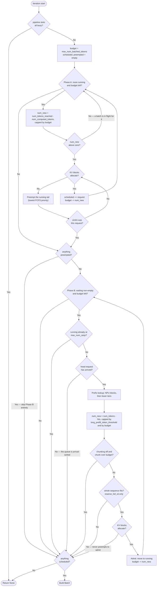

# 连续批处理

调度器是每个服务实例的核心。主循环的每一次迭代都会调用 `scheduler.schedule(current, sys)` 并得到一个 `Batch`（或 `None`）。调度器强制执行与 vLLM 相同的约束：token 预算、序列数量上限，以及可选的分块预填充。本页讲解这些规则。

> 需要配置项说明？请参阅 **[参考 → CLI flags](../../reference/cli-flags)** 查看 flag 列表。本页解释*每个 flag 在内部做什么*。

## 两个阶段，一个调度器

`Scheduler.schedule()`（位于 `serving/core/scheduler.py`）遵循 vLLM V1 的结构，每一步分两个阶段运行：

| 阶段 | 队列 | 行为 |
| --- | --- | --- |
| A | `self.running`（跨步骤持久） | 服务所有运行中的请求。如果某个请求拿不到块，则从 `running` 的**尾部**抢占并重试。 |
| B | `self.waiting`（按到达时间排序） | 在预算和序列槽位允许的情况下准入。遇到第一个无法分配的请求即停止——阶段 B **绝不**抢占。 |

任何发生抢占的步骤都会完全跳过阶段 B。这条防抖动规则保证了运行集合不会在 抢占 → 重新填充 → 抢占 之间震荡。

`--enable-prefix-caching` 不改变代码路径，只决定块是否被索引以便复用。两种模式共用一个调度器。

约束如下：

- **序列上限：** `len(batch) <= --max-num-seqs`。默认 `128`。设为 `0` 表示无限制。
- **Token 预算：** `sum(tokens_to_run_this_step) <= --max-num-batched-tokens`。默认 `2048`。
- **每请求上限（分块预填充）：** `tokens_for_this_request_this_step <= --long-prefill-token-threshold`。默认 `0` = 禁用。

块来自每个实例的 NPU `BlockPool`，其 `num_free_blocks` 是精确的——分配要么成功，要么在同一次调用中报告失败，这决定了是否要抢占。详见 **[前缀缓存](./prefix-caching)**。

## 调度器每一步的选择



关于这个结构，有三点至关重要。**阶段 B 绝不抢占**——其中的每条失败路径都会退出循环，而不是释放别人的块。**任何发生抢占的步骤都会完全跳过阶段 B**，这阻止了运行集合在 抢占 → 重新填充 → 抢占 之间震荡。整个流程还受空闲流水线槽位的门控，因此当 `pp_size > 1` 时，某一步可能纯粹因为每个阶段都已有一个批次在途而返回 `None`。这三点都镜像了 vLLM V1 的 `schedule()`。

还要注意图中*没有*的东西：没有 prefill 分支，也没有 decode 分支。请求只是追赶 `num_tokens_reached`，因此稳态 decode 时 `num_new` 为 1，恢复中的请求则为剩余的全部。轨迹事后按计划执行的 token 数量分类。

概念上，循环如下：

```
budget = max_num_batched_tokens
scheduled, preempted = [], []

# Phase A: requests already running
for request in running:
    if budget <= 0: break
    cap = tokens_to_catch_up(request, budget)
    while allocate_blocks(request, cap) failed:
        victim = running.pop()          # tail = lowest FCFS priority
        preempt(victim); preempted.append(victim)
        if victim is request: break
    if allocation still failed: break
    scheduled.append((request, cap)); budget -= cap

# Phase B: admit from waiting -- skipped entirely if anything was preempted
if not preempted:
    while waiting and budget > 0 and len(running) < max_num_seqs:
        request = waiting[0]
        hit = look_up_prefix(request)   # NPU blocks, then lower tiers
        cap = tokens_to_catch_up(request, budget, from=hit)
        if allocate_blocks(request, cap) failed: break   # never preempts
        waiting.pop(0); running.append(request)
        scheduled.append((request, cap)); budget -= cap

return Batch(scheduled) if scheduled else None
```

`tokens_to_catch_up` 对每种请求状态都是一个表达式：

```
min(req.num_tokens_reached - req.num_computed_tokens,
    long_prefill_token_threshold or infinity,
    budget)
```

- **Prefill，尚未分块：** 提示长度减去任何前缀缓存命中。
- **Prefill，分块中：** 剩余的提示 token。
- **Decode：** 1，因为 `num_tokens_reached == num_computed_tokens + 1`。
- **抢占后恢复：** 两个层级都无法返回的部分。

## 分块预填充

`--long-prefill-token-threshold N`（或 `--enable-chunked-prefill`，它会设置一个合理的默认值）让调度器将长预填充拆分成多个迭代执行。没有它，一个 32k token 的请求会独占整个预算，其他在途请求的 TPOT 会崩溃。

具体来说，剩余预填充为 8000 token 的请求在 `--long-prefill-token-threshold 1024` 下会作为八个独立的 8x1024 token 块在八次调度器迭代中运行。`Request.num_computed_tokens` 字段跟踪进度；每次迭代调度器都会按刚处理的 token 数推进它。

Decode 步骤继续在同一个批次中*并发*运行，分块预填充只是防止长提示独占资源。

## 没有 prefill 阶段，也没有 decode 阶段

调度器中没有任何 prefill-vs-decode 分支，与 vLLM 完全一致。请求只是追赶它已经达到的长度：

```
num_new = req.num_tokens_reached - req.num_computed_tokens
```

稳态 decode 时为 1，prefill 期间为一个块，被抢占后恢复的请求则为整个序列。轨迹改为按**计划执行的 token 数量**分类：多于一个 token 是 prefill 块，恰好一个则是 decode。注意力内核也是这样看待批次的。

## 流水线深度（PP）

对于 `pp_size > 1` 的实例，调度器还维护一个 `inflight` 列表，记录当前正在流水线中穿行的批次。其长度上限为 `pp_size`：当流水线满时，调度器返回 `None`，直到 ASTRA-Sim 排空一个阶段。

这使得模拟器的 PP 行为与生产级训练框架（如 Megatron）一致，后者中微批次流式穿过流水线。

## 调度器何时停止

模拟器在以下条件同时满足时退出：

- 每个调度器都返回 `None`（没有符合条件的请求）。
- `Router.has_pending_requests()` 返回 `False`（没有未来到达）。
- `Router.has_deferred_sessions()` 返回 `False`（没有等待工具调用的 agentic 会话）。

如果只有第三个不为空，主循环将 `current` 快进到下一个待处理到达时间并继续。

## 调度器返回什么

每次迭代 ASTRA-Sim 报告完成时调用一次 `scheduler.add_done(npu_id, sys, current)`。它返回：

```python
(prompt_t, gen_t, end_reqs)
```

- `prompt_t` 统计**包括前缀缓存命中在内的所有输入 token**，与 vLLM 的报告一致，后者同样统计已缓存的 token。`add_done` 中的那一行字面上就是 `prompt_t += num_new + req.prefix_cache_hit`，每个请求触发一次，在其 prefill 完成的那个步骤触发。
- `gen_t` 只统计新生成的 token，当请求追赶至 `num_tokens_reached` 时递增。恢复中的请求重新计算其历史不会在这里贡献任何东西，因此重算永远不会被计为生成。
- `end_reqs` 是在本次迭代中完成的请求列表。

在 P/D 分离下的 prefill 实例中，主循环将 `end_reqs` 交给 `router.transfer_prefill_request`，让 decode 实例接手。

## 注意事项

1. **Prefill 加上前缀缓存**不会重复计数：`hit_len` 从调度器实际运行的 token 中减去，但*加*到 `prompt_throughput` 上。因此一个 1000 token 的请求命中 600 token 前缀时，消耗 400 token 的预算，并报告 1000 token 的提示吞吐量。

2. **`--max-num-seqs 0` 表示无限制**，而不是零。当你想要纯粹的 token 预算门控时很有用，但要注意内存。

3. **Token 预算在 prefill 和 decode 之间共享。** 一个批次有 64 个进行中的 decode 和 1500 token 的 prefill 块时，本步骤运行 1564 个 token。Decode 的贡献也要计入。

4. **流水线并行将 `inflight` 上限设为 `pp_size`。** 每次迭代的层按 transformer 块边界跨阶段切分，之间通过 send/recv 连接，因此阶段间的 P2P 延迟*确实*被建模。

## 下一步

- **[前缀缓存](./prefix-caching)**：块哈希如何链式连接，缓存命中能省下什么。
- **[KV 缓存与内存](./kv-cache-and-memory)**：调度器如何知道内存已满。
