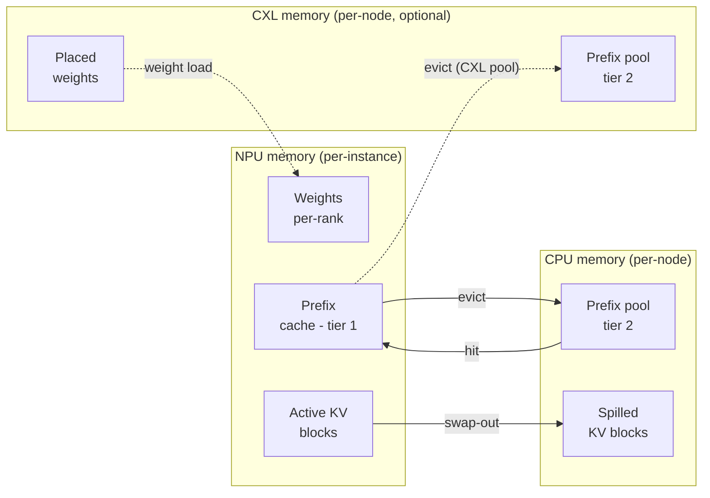

# KV 缓存与内存

每个 `Scheduler` 拥有一个 `MemoryModel`，跟踪任意时刻 NPU 和 CPU（以及可选的 CXL）内存中有多少字节在使用。正是它告诉调度器何时停止接受新请求、什么会触发前缀缓存逐出。

> 想要内存层级的*配置*？参见 **[示例 → CXL extended memory](../../examples/memory-tiers/cxl-memory)** 了解放置规则，以及 **[示例 → Prefix caching](../../examples/memory-tiers/prefix-caching)** 了解第二层池。本页是字节记账那一侧。

## 内存层级



三个层级，每个在 `MemoryModel` 上有一个独立的计数器：

| 层级 | 对象 | 容量来自 | 容纳 |
| --- | --- | --- | --- |
| **NPU** | `npu_used` | `npu_mem.mem_size` × `num_npus` | 权重（每 rank）、活动 KV 缓存、NPU 前缀缓存 |
| **CPU** | `cpu_used` | `cpu_mem.mem_size`（每节点） | CPU 前缀池、被逐出的 KV 块、模型权重暂存 |
| **CXL** *(可选)* | `cxl_used[device_id]` | `cxl_mem.mem_size` × `num_devices` | 取决于放置的 CXL 常驻权重 / KV / 前缀池 |

容量来自集群配置；使用量在运行时跟踪。启动时超出容量（例如 `weight_per_gpu > npu_mem`）是致命错误。运行时超出会触发逐出（对于前缀缓存）或调度器背压（对于活动 KV）。

## NPU 内存里有什么

两个大消费者，按优先级排序：

### 1. 模型权重（每 GPU）

在调度器初始化时通过 `MemoryModel.get_weight()` 计算。大小是模型的完整参数量除以 `tp_size`（对于 MoE：专家再除以 `ep_size`），再乘以 dtype 的字节大小：

```
weight_bytes_per_gpu = (
    dense_params / tp_size
    + moe_params / ep_size  # if MoE
) * fp
```

`fp` 对 `bfloat16` / `float16` 是 2 字节，对 `float32` 是 4，对 `int8` 和 `fp8` 是 1。实际加载通过 `get_weight()` 完成，它会读取模型配置并考虑共享嵌入、权重绑定等。

这块字节数在启动时就在每块 NPU 上预留且从不释放。如果 `weight_per_gpu > npu_mem.mem_size`，模拟器会以清晰的错误消息退出，典型修复是调大 `tp_size`、添加 CXL 放置规则，或选更小的模型。

### 2. 活动 KV 缓存

逐请求的 KV 缓存，按块粒度跟踪。块大小是 `--block-size` token（默认 16）：

```
bytes_per_block = (
    2                                         # K and V
    * num_layers
    * num_key_value_heads
    * head_dim
    * block_size
    * kv_fp
) / num_npus                                  # = tp_size * pp_size
```

除数是 `num_npus`，即 **`tp_size * pp_size`**，而不只是 `tp_size`（`MemoryModel.get_kv()`）。两个因子都属于这里：KV 每层在 TP rank 间分片，而层本身在 PP 阶段间切分，因此 `tp=2 x pp=2` 实例中的一个 rank 持有模型 KV 的四分之一，而不是一半。

另请注意 `head_dim` 是从模型配置中显式读取的，而不是推导的——参见 **[模型配置](../../reference/model-config)**。在 Qwen3 上 `hidden_size / num_attention_heads` 会给出错误答案。

其中 `kv_fp`：

- 对 `bfloat16` / `float16` 是 2 字节——`--kv-cache-dtype auto` 从 `--dtype` 继承的值；对 `float32` 是 4。
- **对 `--kv-cache-dtype fp8` 是 1 字节**，与 16 位权重 dtype 相比 KV 内存减半。

块的数量在启动时就固定了，方式与 vLLM 确定缓存大小相同：

```
requested   = npu_mem.mem_size * npu_mem.mem_util      # per rank
kv_bytes    = requested - model weight
num_blocks  = kv_bytes / bytes_per_block
```

`npu_mem.mem_util` 默认取 `--npu-memory-utilization`（`0.9`），对应 vLLM 的 `--gpu-memory-utilization`。vLLM 还会额外减去激活峰值和 CUDA 上下文，模拟器不建模这些，因此这个容量在相同比例下是 vLLM 的**上界**。运行在启动时的 **KV Cache Initialization** 下打印每个实例的结果数字：

```
  • Instance [0] : 585248 tokens / 36578 blocks (71.44 GiB/rank at util 0.90)
```

:::caution[当 KV 缓存是约束瓶颈时校准 `mem_util`]
`mem_util` 只有在运行确实**饱和** KV 缓存时才改变行为。低于该阈值时，池永远不会耗尽，什么都不被抢占，你配置的容量在结果中不可见。在余量充足的卡上，默认的 `0.9` 完全没问题。

当运行确实触及上限时，这个数字关系重大——而且默认值不是正确的那个。由于模拟器不建模 vLLM 的激活峰值和 CUDA 上下文，这里的 `0.9` 买到的 KV 缓存明显多于 vLLM 中的 `0.9`。更多缓存意味着更少的抢占，因此模拟运行提前结束，每个延迟指标都随之偏移。

这种情况下请根据实测运行来设置它。`python -m bench run` 会把 vLLM 实际解析到的值记录在 `meta.json` 中：

```json
"kv_cache": { "num_gpu_blocks": 2588, "block_size": 16, "num_kv_tokens": 41408 }
```

然后选择其 **KV Cache Initialization** 行报告相同块数的那个 `mem_util`。随附的 RTX 4090 / Llama-3.1-8B 示例正是这种情况——24 GB，在大部分运行时间里钉在天花板上——匹配值是 `0.833919`，而不是 `0.9`：

| | KV tokens | blocks | TTFT 均值 | TPOT 均值 | 延迟均值 |
| --- | --- | --- | --- | --- | --- |
| vLLM（实测） | 41,408 | 2,588 | — | — | — |
| `mem_util: 0.9` | 54,400 | 3,400 | -20.7% | +12.9% | -12.5% |
| `mem_util: 0.833919` | 41,408 | 2,588 | **+0.6%** | **+0.2%** | **+0.5%** |

相同的剖析 bundle、相同的工作负载、相同的引擎 flag——只有容量不同。随附的 RTXPRO6000 示例相比之下峰值只到预算的 58-97%，因此它们保持在 `0.9`：校准没有什么可改变的。从心跳读取峰值 **Each NPU Memory Usage** 百分比来判断你属于哪种情况——记住它的上限是 `mem_util * 100`，而不是 100。
:::

调度器按每个活动请求从池的空闲列表中取 `ceil(tokens / block_size)` 个块，请求完成或被抢占时归还。

### 3. NPU 前缀缓存

不是单独分配。变满的块按其 token 的**链式哈希**建立索引，并在其请求归还空闲列表后保留该索引条目——因此它同时可复用、仍可被找到。之后前缀哈希相同的请求会认领它而不是重新计算。

因此逐出是**分配的副作用**：当池从空闲列表头部拿出一个块、且该块仍带哈希时，哈希就被丢弃。没有单独的逐出遍历，也没有需要估算的"可逐出大小"。使用 `--prefix-storage` 时，块在 CPU 或 CXL 层级还有一份副本，之后的请求仍可在那里找到它。

完整机制：[前缀缓存](./prefix-caching)。

## CPU / CXL 内存里有什么

每节点 CPU 内存（以及每设备 CXL 内存）容纳：

- 开启 `--enable-prefix-sharing` 时的共享**第二层前缀缓存**。
- NPU 逐出的**溢出 KV 块**（启用卸载时）。
- 通过集群配置中的 `placement` 字段**显式放置在那里的权重**（例如某些解码器块在 CXL 设备 0 上的 `"weights": "cxl:0"`）。放置规则语法参见 **[示例 → CXL memory](../../examples/memory-tiers/cxl-memory)**。

与 NPU 内存不同，CPU/CXL 记账是**按节点**的，而不是按实例。同一节点上的多个实例共享同一个 `cpu_used` 计数器。

## 调度器如何使用这些

调度器不做估算。它询问池，池要么交出块，要么在同一次调用中报告失败：

```python
blocks = kv.allocate_slots(request, tokens_to_run_this_step)
if blocks is None:
    ...   # nothing was mutated; the caller decides what to do
```

`num_free_blocks` 是精确的，因此排队的块*确实*可分配。这种全有或全无的性质让两个调用方表现出不同且正确的行为：

- **运行中的请求**拿不到块会导致抢占：调度器丢弃运行集合的尾部，归还该请求的块，然后重试。
- **等待中的请求**拿不到块就只是本步骤不被准入。准入从不抢占，并在第一次失败时停止。

准入还会拒绝整个序列都放不下的请求，而不仅仅是第一个 chunk（`--reserve-full-isl`，默认开启，镜像 vLLM 的 `scheduler_reserve_full_isl`）。只检查第一个 chunk 会让分块预填充准入一个之后增长超出容量的请求，这会在之后变成一次抢占。

因此一旦工作负载填满，内存就停在池上限，而不是震荡。空闲列表中仍带哈希的块是可复用的数据，不是浪费。

## 按实例与按节点的记账（注意事项）

NPU 块池是**按实例**的。同一节点上的两个实例即使在同一块物理 GPU 上，也有完全独立的 NPU 记账。`npu_used` 从池推导而来，而不是在旁边单独跟踪，因此每个层级恰好有一个账本。

`cpu_used` 是**按节点**的。同一节点上的两个实例共享一个 CPU 内存预算。如果两者都向 CPU 溢出了前缀块，它们竞争同一个 `cpu_mem.mem_size` 容量。

这对多实例配置很重要：`num_instances: 4` 且每个实例预留 60 GB NPU 内存意味着每个实例拿到自己的 GPU；但它们都共享节点 `cpu_mem.mem_size` GB 的主机内存。

## 在吞吐量日志中读取内存

每 `--log-interval` 模拟秒发出一次的心跳块为每个实例带一个分支，然后为每个节点带一个分支：

```text
[1.0s] Avg prompt throughput: 9069.0 tokens/s, Avg generation throughput: 224.0 tokens/s
        ├─Running Instance[0]: 9 reqs, Waiting: 0 reqs, Total # 1 NPUs, Each NPU Memory Usage 16486.51 MB (16.771 % Used), Prefix Cache Hit ratio 0.00 %, (0 / 9069)
        └─Node[0]: Total CPU Memory Usage 0.00 MB, 0.000 % Used
```

具体读取内存字段：

- **`Each NPU Memory Usage`** 是每 rank 的，单位 **MB**，涵盖权重加活动 KV 加已索引的前缀块——整个 `npu_used` 账本。百分比针对 `npu_mem.mem_size`，因此上限接近 `mem_util * 100`，而不是 100。
- **`Node[i]: Total CPU Memory Usage`** 是节点的低层总计。在多实例节点上，后面跟着每个实例在该总计中的份额，例如 `(Instance[0]: 61.20 %, Instance[1]: 38.80 %)`。
- 使用 `--prefix-storage CXL` 时会增加一个 `CXL[...]` 分支，`--enable-prefix-sharing` 下每设备一个，否则每个前缀缓存实例一个。

完整的逐字段参考，包括多实例和 CXL 变体：**[读取输出](../reading-output#heartbeat-block)**。

## 注意事项

1. **启动时 OOM** 总是权重 vs NPU 容量的问题。错误消息指向精确的字节数；调大 `tp_size` 或减小模型大小。
2. **运行中 OOM** 不常见，但 CXL 放置配置错误时可能出现。检查心跳块的 `CXL[...]` 分支，它只在 `--prefix-storage CXL` 下出现。
3. **`block_size` 影响内存粒度，不影响吞吐量。** 更小的块 = 更精细的记账，但每个请求的开销更大。默认 16 是 vLLM 使用的值。
4. **FP8 KV 缓存将 KV 字节预算减半**，但你还需要一个 `*-kvfp8` 变体的剖析 bundle（例如 `bf16-kvfp8`）。没有它，模拟器会以 variant-not-found 消息报错。
5. **权重内存在运行期间是固定的。** 添加更多请求不会让它增长；只有 KV 缓存会。吞吐量日志行顶部可见的"权重上限"保持不变。

## 下一步

- **[轨迹生成](../trace-generation)**：*给定*内存状态时每次迭代的延迟如何计算。
- **[示例 → Prefix caching](../../examples/memory-tiers/prefix-caching)** 和 **[CXL memory](../../examples/memory-tiers/cxl-memory)**：配置角度。
