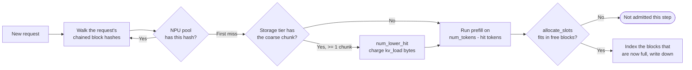

# 前缀缓存

前缀缓存让请求跳过 KV 已驻留的 token 的 prefill 工作。该机制移植自 vLLM v0.19.0 的块池：块通过**链式哈希**标识，与已缓存内容共享前缀的请求直接认领这些块，而不是重新计算。

> 想找"如何启用它"/"应该设置哪些 flag"？请参阅 **[示例 → Prefix caching](../../examples/memory-tiers/prefix-caching)**。本页讲解底层的块池机制。

## 链式块哈希

每个完整的 `block_size` token 块都会得到一个折叠了前一块哈希的哈希：

```
h(0) = hash(SEED,   tokens[0:16])
h(1) = hash(h(0),   tokens[16:32])
h(2) = hash(h(1),   tokens[32:48])
...
```

由于链是累积的，`h(i)` 标识的是*到第 i 个块为止的整个前缀*，而不只是该块的 16 个 token。因此查找就是一次遍历：先试 `h(0)`，再试 `h(1)`，在第一个未命中处停止。未命中之后的所有内容要么未计算、要么已消失，没有可检查的。

有两个值得知道的后果：

- **恢复出的前缀按构造是连续的。** 中间的洞会把命中截断在洞的位置。
- **只有完整块才会被缓存。** 最后一个块边界之后的尾部总是重新计算——最多 `block_size - 1` 个 token，再加上一个，因为命中上限为 `num_tokens - 1`（最后一个 token 必须运行才能产生 logits）。

哈希覆盖 `input_hash_ids + output_hash_ids`，因此**生成的** token 也可以被缓存，不只是提示。

## 层级

每个实例最多三个 `BlockPool`，按顺序查找：

| 层级 | 对象 | 存放位置 | 块大小 | 必需？ |
| --- | --- | --- | --- | --- |
| **NPU 池** | `MemoryModel.npu_pool` | NPU 内存 | `--block-size`（默认 16） | 始终存在，并在 `--enable-prefix-caching`（默认开启）时建立索引 |
| **存储池** | `MemoryModel.storage_pool` | CPU 或 CXL | 256 token（LMCache 的 chunk） | 可选，`--prefix-storage` |

所有层级共享**同一个键空间**。块大小为 N 倍的层级在同一链的每第 N 个哈希上建键——即每个粗粒度块覆盖的最后一个细粒度哈希——因此对请求哈希的一次遍历就能同时得到 NPU 命中与存储命中。不需要第二个哈希函数，也不需要保持一致的独立索引。

NPU 池是**按实例**的：落在实例 B 上的请求无法复用缓存在实例 A 上的前缀。

当 `--enable-prefix-sharing` 开启时，存储池在**同一节点上的实例之间共享**。这正是前缀缓存在多实例部署中有用的原因；没有它，每个实例都有自己的私有池。

`--prefix-storage` 选择存储池存放的位置：
- `None` → 没有存储层级（默认；只有 NPU 池）。这是纯 vLLM。
- `CPU` → CPU 内存（使用节点的 `cpu_mem` 预算）。
- `CXL` → CXL 内存（需要在集群配置中有 `cxl_mem` 块）。

有存储层级时，模拟器的行为就像 vLLM 挂接了 LMCache 或 `OffloadingConnector`：该层级是**包含式**的（每个在 NPU 上完成的块都会写下来），满时丢弃最近最少写入的 chunk。

写入不花费延迟——vLLM 的 `OffloadingConnector` 正是把它推迟到下一个引擎步骤、放在专用流上，以免延迟 token 生成——但读回是要花费的，轨迹中的 `kv_load` 收取的就是这次读取。

## 查找流程



调度器考虑等待中的请求时：

1. `request_block_hashes(req, block_size)` 一次性构建链式哈希并缓存在请求上。
2. 与 NPU 池比对，在第一个未命中处停止 → `num_npu_hit`。这些块被 `touch()`，如果它们是被逐出候选，就从空闲列表中取出。
3. 如果存在存储层级，从那里继续，按*它自己的*粒度：将 NPU 命中向下取整到 chunk 边界，统计连续的 chunk 命中，并且只有在至少获得一个完整 chunk 时才采纳 → `num_lower_hit`。这些字节以 `kv_load` 计费。
4. `num_new = num_tokens_reached - (num_npu_hit + num_lower_hit)`。
5. `allocate_slots` 要么预留块，要么返回 `None`。返回 `None` 时，请求本步骤就不被准入——准入从不抢占任何东西。

每个分量都记录在 `Request` 上：

```python
request.prefix_cache_hit   # total hit
request.npu_cache_hit      # NPU pool only
request.storage_cache_hit  # NPU + storage
```

这些会出现在吞吐量日志行和逐请求 CSV 中。

## 插入看起来什么样

`cache_blocks(req, num_tokens)` 将请求中现在已满的每个块按其链式哈希建立索引，并且是幂等的——它跟踪已索引的数量，因此在每个 chunk 之后调用它是零成本的。只有在这之后，下一个共享相同前缀的请求才能命中。第一个请求总是支付完整的 prefill 成本。

有存储层级时，同一个调用会把任何已完全覆盖的粗粒度 chunk 写下去。

## 逐出

逐出是**分配的副作用**，而不是单独的遍历。当 `get_new_blocks` 从空闲列表弹出块、且弹出的块仍带有哈希时，该哈希就被丢弃。没有 `evict()` 调用，没有"可逐出大小"，也没有可能落空的回收步骤。

丢弃哈希在任何模式下都没有成本：

- 块属于已完成的请求 → 它只是缓存
- 块属于被抢占的请求且存在存储层级 → 副本已经在下面，在关键路径之外写入
- 没有存储层级 → 什么都没写下来，因此请求重新计算，这正是 vLLM 的做法

释放的块进入空闲列表的**尾部**，所以它最后被复用。请求按逆序释放自己的块，因此在压力下尾部先走，头部——可恢复的前缀——存活最久。

## 抢占的代价

被抢占的请求除了身份什么都不保留：`num_computed_tokens` 归零，其块被释放。这是 vLLM 自身的行为，而且它不是重新预填充，因为块保留了哈希。重新准入时，上面的查找会找到任何幸存下来的内容，只有剩余部分被重新计算：

| 情况 | 恢复时的代价 |
| --- | --- |
| 块仍驻留在 NPU 上 | 只有块对齐的尾部 |
| 块被丢弃，存储层级中有副本 | 缺失 chunk 的 `kv_load` 传输 |
| 块被丢弃，没有存储层级 | 重新计算——计入 `Recomputed prompt tokens` |

## 跨层级的块大小

NPU 池和存储池使用**不同的块大小**，这是有意为之，而不是取整的产物：

- NPU 池：`--block-size`（默认 16），与 vLLM 的 GPU 块大小一致。
- 存储池：256 token，与 LMCache 默认的 `chunk_size` 一致。宿主机层级想要更少、更大的传输。

存储大小必须是 NPU 大小的整数倍，因为该层级在同一链的每第 N 个哈希上建键（N = 256/16 = 16）。一个可以预期的后果：存储命中只能以完整的 256 token 步长扩展前缀，因此 200 token 提示的请求永远无法命中存储层级。

## 报告了什么

每次迭代的 `add_done` 调用都会更新这些计数器：

| 计数器 | 你实际能在哪里看到它 |
| --- | --- |
| 逐请求的 `prefix_cache_hit` / `npu_cache_hit` / `storage_cache_hit` | **输出中任何地方都没有。** 记录在 `Request` 对象上，但不写入逐请求 CSV。要拿到它，请直接读取对象或扩展 `Scheduler.save_output` |
| 逐实例命中率 | 心跳的实例分支：`Prefix Cache Hit ratio 7.59 %, (19520 / 257239)`。**自运行开始以来的累计值**，不是按间隔的 |
| 共享低层命中率 | 心跳 `Node[i]` 分支上的同一字段，但只在 `--enable-prefix-sharing --prefix-storage CPU` 下才有，此时池是节点级的 |
| 低层池占用 | `Node[i]: Total CPU Memory Usage ...` 或 `CXL[...]` 分支，以 MB 和百分比显示 |
| 按层级划分的运行总计 | 最后的 **Prefix Caching Results** 部分：请求的 token、NPU 命中 token 及比例、设置 `--prefix-storage` 时的 `<tier>` 命中 token 及比例，以及合计总数 |

心跳中没有逐迭代的命中计数器，也没有 NPU-vs-CPU 细分：按层级划分只出现在最终摘要中。参见 **[读取输出](../reading-output#heartbeat-block)**。

## 注意事项

1. **前缀缓存默认开启。** 如果你特别想要没有它的基线（研究基线对比等），请使用 `--no-enable-prefix-caching`。
2. **哈希针对的是输入 token ID。** 如果你的数据集存的是原始文本，而模拟器的分词方式与你的推理引擎不同，命中将无法匹配。请预先分词（在 JSONL 中提供 `input_tok_ids`）以获得稳定的哈希。
3. **NPU 逐出是分配的副作用**，因此一旦工作负载填满池，内存就停在池上限。这个平台期是正常的——空闲列表中仍带哈希的块是可复用的数据，不是浪费。
4. **存储池不会在实例关闭时自我释放。** 这是有意为之（这样长时间运行的多阶段工作负载可以继续复用池），但残留条目在最终摘要中可见。
5. **命中只能来自完整块。** 恢复中的请求总是至少重新计算一个 token，最多 `block_size` 个（当恢复来自存储时最多一个 256 token 的 chunk）。

## 下一步

- **[KV 缓存与内存](./kv-cache-and-memory)**：底层块记账如何工作。
- **[示例 → Prefix caching](../../examples/memory-tiers/prefix-caching)** — 配置 / flag 层面的演练。
