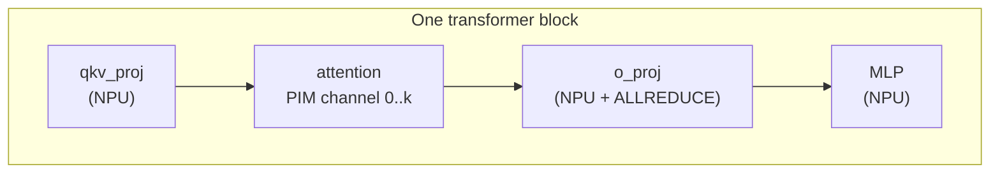

# PIM 卸载

存内处理（processing-in-memory，PIM）把计算单元物理地放入 DRAM，把传统上受内存带宽限制的内核变成数据路径上的计算操作。LLMServingSim 将 PIM 建模为一个独立设备，它可以接管**attention**，层的其余部分仍在 GPU 上运行。

本页描述 PIM 路径在模拟器内部如何工作。*配置*角度（传什么 flag、如何在集群配置中接好 PIM 设备）见 **[示例 → PIM attention 卸载](../../examples/disaggregated/pim-attention-offload)**。

## 卸载什么，不卸载什么

开启 `--enable-attn-offloading` 时：

| 层 | 运行位置 |
| --- | --- |
| `embedding`、`layernorm`、`qkv_proj`、`qk_norm`、`rotary_emb` | NPU |
| `attention` | **PIM** |
| `o_proj`、`gate_up_proj`、`act_fn`、`down_proj` | NPU |
| `final_layernorm`、`lm_head`、`sampler` | NPU |
| MoE 块（如适用） | NPU |

因此只有 attention 本身移到 PIM。attention 的 KV 缓存随之移动，KV 块存放在 PIM 内存而非 NPU 内存，从而为权重或更大的批次腾出 NPU 内存。

token 流通过内存写（输入激活）从 NPU 跨到 PIM，再通过内存读（attention 输出）从 PIM 回到 NPU。这些跨越在轨迹中建模为内存传输。

## 它在轨迹中如何呈现



`trace_generator._emit_sequence` 遍历架构 YAML 的层列表。当它看到 `attention` 层**且** `enable_attn_offloading=True` 时，会在 NPU attention 内核之前换入一个 PIM 块：

```
... qkv_proj_3 ... (NPU)
PIM 0
pim_attention_3   (PIM device, modeled latency)
PIM END
... o_proj_3 ... (NPU, ALLREDUCE if TP > 1)
```

`PIM 0` / `PIM END` 标记告诉 Chakra 转换器，包含的操作在 PIM 设备的通道 0 上运行。转换器为 PIM 计算发出一个 `COMP_NODE`，其内存访问模式反映 PIM 基板。

`pim_attention_<i>` 条目的延迟来自 PIM 模型（见下文），而非 NPU attention CSV。

## PIM 模型

`serving/core/pim_model.py` 定义 `PIMModel`。当集群配置带有 `cpu_mem.pim_config: "<config_name>"` 字段时，它为每个节点实例化一个。构造函数读取 `configs/pim/<config_name>/` 下的 DRAMSim3 INI 文件：

```
configs/pim/DDR4_8GB_3200_pim/
├── DDR4_8Gb_x16.ini    # DRAM device parameters
├── system.ini          # bus / channel layout
└── pim.ini             # PIM compute parameters
```

INI 文件指定：

- **DRAM 时序**：`tCAS`、`tRCD`、`tRP`、刷新间隔等。
- **布局**：每芯片 bank 数、通道数、行大小、列大小。
- **PIM 计算**：每 bank 每周期操作数、指令集上限。

`PIMModel` 把时序参数暴露给轨迹生成器，后者用它们计算 PIM 上的每次 attention 延迟。该模型刻意保持简单，它不是周期精确的 DRAM 模型，但能充分捕捉带宽、并行度（bank × 通道）和操作吞吐量，足以比较 PIM 与 NPU 的 attention 路径。

## 多 PIM 通道

节点的 PIM 设备可以有多个通道。每个通道有自己的 bank 级并行度，因此不同的 attention 头可以在不同通道上并行运行。轨迹生成器按如下方式把 attention 工作分布到各通道：

```
channel_for_head(h) = h * num_channels // num_attention_heads
```

这会变成轨迹中的 `PIM <channel>` 标记。ASTRA-Sim 看到多个 `PIM 0`、`PIM 1`、…… 块并并行运行它们。

## PIM 内存中的 KV 缓存

开启 PIM 卸载时，KV 块存放在 PIM 内存（按通道）而非 NPU 内存。内存模型对此有所体现：

- `npu_used` 减去 KV 缓存占用。
- **没有 `pim_used` 计数器。** `MemoryModel` 只暴露两个账本 `npu_used` 和 `cpu_used`，驻留 PIM 的 KV 计入后者，因为 PIM 位于节点 `cpu_mem` 所描述的主机内存中。心跳的 `Node[i]: Total CPU Memory Usage` 行就是它的显示位置。
- KV 驱逐从 PIM → `kv_evict_loc` 指向的位置，而非 NPU → CPU。

这就是 PIM 卸载对长上下文工作负载具有内存吸引力的原因：GPU 的 HBM 被腾出来容纳更大的权重或更多在途请求。

## 为什么 TPOT 通常会改善而 TTFT 会回退

- **解码**受内存带宽限制。PIM 拥有很高的*聚合*带宽（计算与字节同处一地），即使其每通道原始 GB/s 低于 HBM。在长上下文解码中，PIM attention 常常胜过 GPU attention。
- **预填充**在 attention 上是计算受限的（长序列按平方规模增长）。PIM 每通道更窄的计算能力帮不上忙——反而有害。以预填充流量为主的工作负载在 PIM 卸载下会回退。

标准修复是**子批交错**：让批次一半的 GPU 计算与另一半的 PIM attention 重叠。见 [示例 → 子批交错](../../examples/advanced/sub-batch-interleaving)。

## PIM 卸载*不会*往日志里加什么

什么都不加。无论是否带 `--enable-attn-offloading`，心跳块都完全相同——模拟器里没有任何 PIM 利用率或繁忙比例计数器。

卸载通过在生成的轨迹内部用 PIM attention 替换 NPU attention 内核来工作，因此它的效果表现为生成吞吐量和 TPOT 的变化，而不是新增字段。要把性能下降归因于 PIM：

- 带和不带 `--enable-attn-offloading` 各运行一次同样的工作负载，比较 TPOT。
- 传 `--save-trace-text` 并读取生成的轨迹：PIM 工作位于 `PIM <channel>` 与 `PIM END` 标记之间，有自己的 `comp_time`。
- 加宽节点的 `cpu_mem.mem_size` 以购买更多 PIM 通道——通道数由它推导而来，而非显式声明。见 **[PIM 配置](../../reference/pim-config#how-the-numbers-are-derived)**。

## Gotchas

1. **PIM 卸载是按节点的。** `cpu_mem.pim_config` 位于节点上，而非实例上。同一节点上的多个实例共享同一个 PIM 设备。
2. **`--enable-attn-offloading` 是 CLI 默认值。** 单个实例可以用集群配置中的 `enable_attn_offloading` 覆盖它，但任何使用 PIM 卸载的节点仍然需要 `cpu_mem.pim_config`。
3. **没有 PIM CSV 包这种东西。** 与 NPU 不同，PIM attention 延迟由 DRAMSim3 参数加上 `pim_model.py` 的算术解析计算。对真实 PIM 设备做剖析是未来的工作。
4. **子批交错需要 PIM 卸载。** 没有 `--enable-attn-offloading` 时，`--enable-sub-batch-interleaving` 是空操作（一切都在 NPU 上，没有可重叠的东西）。
5. **DRAMSim3 INI 的调整在下次启动时生效。** 模拟器在启动时只读一次。运行中途改参数需要重启。

## 下一步

- **[示例 → PIM attention 卸载](../../examples/disaggregated/pim-attention-offload)** — 配置讲解。
- **[功耗模型](./power-model)**：PIM 在节点 `power` 块中有自己独立的 idle / active 功率参数。
