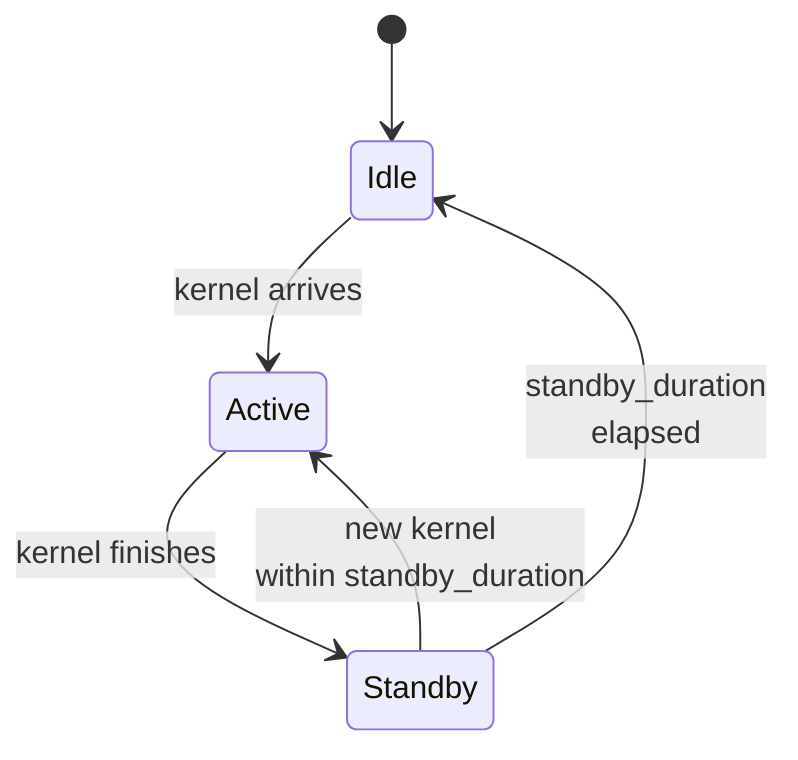

# 功耗模型

当你在集群配置的节点上添加 `power:` 块时，模拟器会按组件跟踪系统功耗，并对模拟时间积分，最终得到一个能量数值。本页讲解内部机制；配置角度请见 **[示例 → 功耗建模](../../examples/advanced/power-modeling)**。

## 建模内容

`serving/core/power_model.py::PowerModel` 按六个类别跟踪每个节点的功耗：

| 组件 | 参数 | 何时耗电 |
| --- | --- | --- |
| **基础节点** | `base_node_power`（W） | 始终（主机平台开销） |
| **NPU** | `idle_power`、`standby_power`、`active_power`、`standby_duration`（按硬件） | 空闲时 idle，计算结束后 standby 持续 `standby_duration`，计算期间 active |
| **CPU** | `idle_power`、`active_power`、`util` | 持续 `idle + (active - idle) × util` |
| **DRAM** | `dimm_size`、每条 DIMM 的 `idle_power`、`energy_per_bit` | 空闲基线 + 按字节访问能量 |
| **链路** | `num_links`、`idle_power`、`energy_per_bit` | 空闲 + 按字节网络流量 |
| **NIC** | `num_nics`、`idle_power` | 始终（空闲基线） |
| **存储** | `num_devices`、`idle_power` | 始终（空闲基线） |

集群配置中每个节点的 `power:` 块设置这些参数。完整的示例见随附的 `single_node_power_instance.json` 和 `single_node_pim_instance.json`。

## 数学原理

能量是功率对时间的积分。模拟器以纳秒为刻度完成积分：每次迭代计算自上次功率更新以来经过的时间，乘以当前功率，并累加到运行中的能量总额：

```
ΔE = P(current_state) × Δt    [焦耳 = 瓦 × 秒]
total_energy += ΔE
```

关键在于**按组件跟踪**。NPU 功耗取决于它正在运行内核（active_power）、刚刚结束（standby_power 持续 `standby_duration` ns，然后回到 idle）还是空闲。没有存储的 `last_compute_end_ns` 字段：轨迹生成器每次调用时传入边界，即 `add_npu_standby_energy_consumption(hardware, node_id, current_ns, last_end_ns, last_calc_ns, num_npus)`，模型根据 `current_ns - last_end_ns` 与该硬件配置的 `standby_duration` 推导出 standby 窗口，一旦耗尽就钳制为零。

CPU、DRAM、链路、NIC、存储更简单：每个组件都有一个恒定的背景耗电，再加上按事件（流量 / 访问字节）的能量增量。

## NPU 状态



NPU 是最细腻的组件。三种状态及各自适用的功率系数：

| 状态 | 功率 | 何时 |
| --- | --- | --- |
| **Active** | `active_power` | 内核运行中 |
| **Standby** | `standby_power` | 距上次内核结束在 `standby_duration` ns 以内 |
| **Idle** | `idle_power` | 距上次内核超过 `standby_duration` |

`standby_duration`（ns）控制计算结束后 NPU 停留在 standby 状态的时间。这模拟了设备回落到 idle 之前的内核后开销（FP32 结果排空、DMA 冲刷等）。对于 RTXPRO6000，随附配置为 `standby_duration: 18` ns；对于 H100 则更大（例如约 30 ns）。

如果在 `standby_duration` 内到达新内核，NPU 不会进入 idle，而是从 standby 再次变为 active。这对 NPU 基本始终繁忙的稳态工作负载很重要。

## 功耗在哪里报告

### 周期性吞吐量日志

每 `--log-interval` 模拟秒，心跳块会多出一个末尾分支：

```text
        └─Avg power consumption: 712.4 W
```

虽然看起来像快照，但这是**区间平均值**：`get_current_power()` 取自上次心跳以来累计的能量，除以经过的模拟时间。它还把**所有节点**的功率汇总成一个标量，因此是集群数值，而非单节点数值。

### 最终汇总

模拟结束时，`power_model.print_power_summary()` 写出按节点的能量分解：

```
─────── Power summary (node 0) ───────
   NPU active     :   12,453 J  (78%)
   NPU standby    :    1,012 J   (6%)
   NPU idle       :       89 J   (1%)
   CPU            :    1,233 J   (8%)
   DRAM           :      442 J   (3%)
   Link           :      388 J   (2%)
   Base + NIC + storage : 332 J  (2%)
   ─────────────────────────────────
   Total energy   :   15,949 J
```

无论 `--log-level` 如何都会输出。分解正是功耗建模对能效研究有价值的原因：你可以看出哪些组件占主导。

## 多节点功耗

每个节点都有自己的 `power:` 块。模拟器并行运行所有节点的功耗模型，但心跳仍然只打印**一个**聚合数值——`get_current_power()` 在返回前会跨节点累加。按节点归属只有最终汇总中才有：每个节点打印一个 `Node <i> total energy consumption (kJ)` 块，其下是按设备的分解，外加集群总计和完整的按区间功率序列。

## 每个 NPU 的 active 功率来自哪里

每个 NPU 的 `active_power` 按实例上的 `hardware:` 字段取值：

```json
"power": {
  "npu": {
    "RTXPRO6000": {
      "idle_power": 35,
      "standby_power": 300,
      "active_power": 600,
      "standby_duration": 18
    }
  }
}
```

对于多硬件集群，列出多个条目：

```json
"power": {
  "npu": {
    "RTXPRO6000": { ... },
    "H100": { ... }
  }
}
```

模拟器根据每个实例的 `hardware:` 字段查找对应条目。如果你的配置使用了没有匹配功耗条目的硬件标签，模拟器会跳过该 NPU 的功耗跟踪（并在启动时给出警告）。

## Gotchas

1. **没有 `power:` 块 = 没有功耗模型。** 模拟器正常运行，只是不输出功耗数值。添加该块即启用；移除它可让运行稍快一点。
2. **功耗值是估算值。** 它们用于*相对*比较（"PIM 卸载相比 HBM attention 是否更省电？"），而非绝对的数据中心核算。
3. **`standby_duration` 比你想象的更重要。** 有长空闲间隙的突发工作负载会产生大量 idle 状态能量，而稳态工作负载会停留在 active 或 standby。如果你的数值看起来意外，请检查最终汇总中的 standby 与 idle 分解。
4. **按事件的能量是按字节而非按操作。** 链路能量随流量字节数缩放，而非集合通信次数。杠杆是减小 `comm_size`，而不是降低集合通信频率。
5. **`--log-interval 0.1` 会让功耗日志非常嘈杂。** 默认的 `1.0` 通常适合跟踪趋势；更细的区间会产生更平滑的曲线，但代价是更长的日志文件。

## 下一步

- **[示例 → 功耗建模](../../examples/advanced/power-modeling)** — 配置讲解。
- **[PIM 卸载](./pim-offload)**：PIM 有自己独立的 active / standby 功率参数，与本模型集成。
