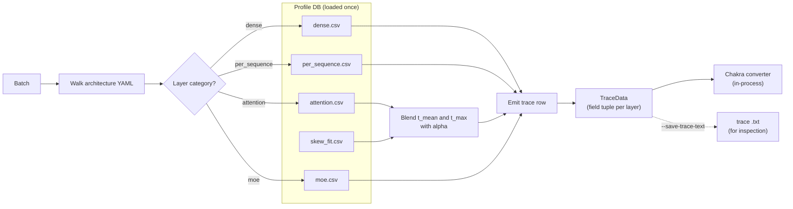

# 轨迹生成

`trace_generator.generate_trace(...)` 是**剖析延迟数据库**（性能剖析器产生的 CSV 文件）与 **ASTRA-Sim 消费的每批次执行轨迹**之间的桥梁。

这是"模型有 32 个 decoder 块，每个块有 qkv + attention + o_proj + mlp"变成"这个批次需要 1.78 ms"的页面。

> 在找轨迹文件格式规范？参见 **[参考 → 轨迹文件格式](../reference/trace-format)**。在找性能剖析器如何*产生*延迟数据库？参见 **[性能剖析器 → 输出包](../profiler/output-bundle)**。本页介绍模拟器如何*消费*它。



## 模拟器消费的数据

性能剖析器在以下位置写入按类别划分的 CSV：

```
profiler/perf/<hardware>/<model>/<variant>/tp<N>/{
  dense.csv,
  per_sequence.csv,
  attention.csv,
  moe.csv,           # MoE models only
  skew.csv,          # if heterogeneous-decode sweep is on
  skew_fit.csv       # ditto, the fitted alpha table
}
meta.yaml
```

其中 `<variant>` 编码 dtype 组合，例如 `bf16`、`bf16-kvfp8` 或 `fp8-kvfp8`。模拟器在运行时通过 `resolve_variant(dtype, kv_cache_dtype, model_config)` 解析 variant。

CSV 保存 `time_us`（微秒）。模拟器在加载时乘以 1000 并取整为 ns，所有内部延迟都以 ns 为单位。

## 加载性能 DB

`_load_perf_db(hardware, model, variant)` 在模拟器生命周期内对每个唯一的 `(hardware, model, variant)` 三元组调用一次；结果缓存在 `_perf_db_cache` 中。每个批次都调用它太慢了。

首次加载时，模拟器还会：

1. 读取 `meta.yaml`，将运行时的 `--max-num-batched-tokens` 和 `--max-num-seqs` 与剖析扫描边界比较。如果超出，你会收到一次性警告，说明查找将**外推**而不是钳制。
2. 从 `skew_fit.csv` 水合 skew_fit 表（`alpha_by_bucket` 映射）。

## 按类别查找

模型架构 YAML 中的每一层都带有一个**类别**标签：dense、per_sequence、attention 或 moe。每个类别有自己的查找函数：

| 类别 | 查找函数 | 键 | 插值 |
| --- | --- | --- | --- |
| `dense` | `_lookup_dense` | `total_len`（批次中 token 总和） | 1D 线性 |
| `per_sequence` | `_lookup_per_sequence` | `num_requests` | 1D 线性 |
| `attention` | `_lookup_attention` | `(prefill_chunk, kv_prefill, n_decode, kv_decode)` | 4D 线性（每个轴括住 + 混合） |
| `moe` | `_lookup_moe` | `(local_tokens, activated_experts)`（每 rank，在 TP=1 下剖析） | 2D 线性 |

每个轴都由其两个相邻的剖析值括住，并在线性尺度上混合。

所有查找在剖析网格之外都会**外推**（通过线性延伸），因此大于最大剖析样本的运行时值不会失败，它会产生一个（不太可靠的）外推延迟。上面的启动警告会告诉你何时发生这种情况。

每个网格点的 `time_us` 值在加载时转换为 ns，因此查找直接产生 ns。

## Variant 解析

`resolve_variant(dtype, kv_cache_dtype, model_config)` 镜像性能剖析器的 `effective_variant`：

```
dtype           dtype-from-CLI or torch_dtype from model config
                  (default 'bfloat16')

kv_cache_dtype  CLI value, default 'auto' (inherits from dtype)

variant         f"{short(dtype)}"                       # if kv_cache_dtype == 'auto'
                f"{short(dtype)}-kv{short(kv_cache_dtype)}"  # otherwise
```

所以：

- `--dtype bfloat16` → `bf16`
- `--dtype bfloat16 --kv-cache-dtype fp8` → `bf16-kvfp8`
- `--dtype fp8 --kv-cache-dtype fp8` → `fp8-kvfp8`

如果解析出的文件夹在 `profiler/perf/...` 下不存在，模拟器会抛出指向缺失 variant 的清晰 `FileNotFoundError`。要么在性能剖析器上用 `--variant <name>` 剖析该组合，要么选择不同的 dtype 组合。

## 异构解码 skew 校正

FlashAttention 的 varlen 内核在解码批次 KV 长度不均匀时会付出 tile 填充和 SM 不平衡代价。普通注意力网格看不到这一点，它每次射击都用均匀的 `kv_decode` 剖析。因此性能剖析器在双峰批次上运行**第二次扫描**（`skew.csv`），并拟合每个桶的 **alpha**，说明偏斜批次落在均值→最大值线上的什么位置：

```
alpha = (t_skew - t_mean) / (t_max - t_mean)
```

运行时，`_lookup_attention_with_skew` 在其 `kv_decode_mean` 处查找批次，并向 `kv_decode_max` 处的第二次查找混合：

```
t_attention = t_mean + alpha * (t_max - t_mean)
```

仅当非零 alpha 适用时才进行第二次查找。只有一个解码的批次、或每个解码长度相同的批次、或解析为 `alpha = 0` 的批次，直接返回 `t_mean`。

桶键由五个轴构建：
`pc | n_label | skew_rate_label | kv_big_label | kp_label`

- `pc`：预填充块大小（每个剖析值一个桶）。
- `n_label`：`n_decode` 值（每个剖析值一个桶）。
- `skew_rate_label`：归一化偏斜率，固定 [0,1] 方案。
- `kv_big_label`：长 KV 的对数 4× 分箱。
- `kp_label`：`kv_prefill` 值（每个剖析值一个桶）。

桶轴定义位于 `meta.yaml::skew_fit.bucket_axes`，因此加宽剖析扫描无需任何模拟器代码改动就能点亮更细的分辨率。

如果未运行 skew 扫描（剖析时 `SKIP_SKEW=1`），模拟器**不**应用任何校正（`alpha = 0`，即 `t_mean`）。需要的话就剖析 skew。skew 校正的剖析角度记录在 **[性能剖析器 → Skew 与 alpha 拟合](../profiler/skew-alpha-fit)**。

## 遍历架构 YAML

每个模型在 `profiler/models/<model_type>.yaml` 有一个架构 YAML（例如 `llama.yaml`、`qwen3_moe.yaml`）。YAML 包含：

- 一个 `catalog:` 映射，将规范层名（例如 `qkv_proj`、`attention`、`moe`）映射到 vLLM 类名。
- 一个 `sequence:` 描述每次迭代的层顺序：`prologue → pre_attn → post_attn → (mlp_dense | mlp_moe) → head`。

`trace_generator._emit_sequence` 遍历序列列表，为每层发射一行轨迹。它还会：

- 当 `tp_size > 1` 时，在 `o_proj` 和 `down_proj` 之后附加 **TP-ALLREDUCE**。
- 当 MoE 激活时，用 **EP-ALLTOALL** 标记包裹 MoE 块。
- 当 `--enable-attn-offloading` 开启时，在 NPU 注意力内核之前换成 PIM 注意力。
- 当序列层在 profile CSV 中缺失时一次性警告（这样你就知道要扩展 profile）。

## DP 组改变什么

当实例处于 `dp_group` 中时，轨迹生成被**推迟**，直到所有 DP 成员都为当前迭代调度了批次。模拟器收集每个成员的 `total_len`，取组内的**最大值**，并将其用于 EP-ALLTOALL `comm_size`：

```
comm_size_alltoall = max(total_len_per_member) * hidden_size * fp_size
```

每个成员的轨迹在密集层和注意力内核上仍然使用自己的每实例 `total_len`，只有 ALLTOALL 是同步的。这与生产 MoE 服务的行为一致（vLLM CUDA-graph 在波中填充到最大值）。

完整的 DP+EP 波同步机制见 **[并行机制](./parallelism-mechanics)**。

## 块复制优化

对于 `num_hidden_layers > 1`（即所有模型）的模型，轨迹的 transformer 块除层索引外完全相同。逐层生成每一层的行很浪费，因此默认 `enable_block_copy=True`：

- 只为**块 0** 生成完整轨迹。
- 对于块 1..N-1，发射一条 Chakra `block_copy` 指令，以调整后的层索引重放块 0 的计算模式。

这对密集模型**总是**安全的。对于 `--expert-routing-policy BALANCED`（默认）的 MoE 也是安全的，因为该策略是确定性的，每层产生相同的 `(local_tokens, activated_experts)` 对。对于 `RR` / `RAND`，批次饱和后每层方差很小，因此块复制仍然是无害的近似；需要每层方差的 `CUSTOM` 策略可以在 gate 路由器构造函数中通过 `block_copy=False` 禁用它。

## MoE 的每 rank 延迟

MoE 在轨迹中使用 `EXPERT {i}` / `EXPERT END` 标记，每个 EP rank 一个 `COMP_NODE`。每个 rank 的延迟来自 MoE CSV，以其**本地** token 数和激活专家为键（在 TP=1 下剖析）。各 rank 并行执行，并在 ALLTOALL 屏障处同步。

专家到 rank 的分配使用均匀划分：`expert_id * ep_size // num_experts`。

## Gotchas

1. **CSV 中的 `time_us` 是微秒。** 模拟器在加载时转换为 ns。如果你将 CSV 行与模拟器日志行交叉对照，请乘以 1000。
2. **没有校准缩放。** 剖析延迟被直接使用，不会重新缩放。如果你的 profile 看起来不对，重新剖析而不是调整"缩放因子"，这里没有这种东西。
3. **首次加载很慢**（性能 DB 解析）；后续加载命中 `_perf_db_cache`。重启模拟器会再次付出解析成本。
4. **variant 文件夹必须存在。** dtype + KV 组合不匹配 → `FileNotFoundError`。要么剖析该组合，要么选择不同的 `--dtype` / `--kv-cache-dtype` 对。
5. **skew 校正只在剖析过 skew 扫描时生效。** 否则你得到单一的合并 alpha，这在平均意义上是正确的，但会失去对异构性的敏感性。

## 接下来

- **[并行机制](./parallelism-mechanics)**：TP-ALLREDUCE / EP-ALLTOALL 在轨迹中实际长什么样。
- **[参考 → 轨迹文件格式](../reference/trace-format)**：本页产生的文本轨迹的逐字段规范。
