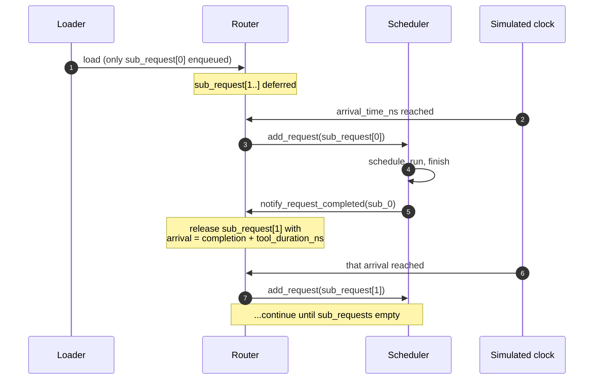

# 智能体会话

像 ShareGPT 这样的标准推理基准测试建模的是*独立*的 prompt：每个请求是一个 prompt → 一个响应，下一个请求与上一个无关。**智能体**的真实生产流量不是这样的。

一个编码智能体（Cursor、Aider 或 SWE-bench 求解器）运行一个紧凑的循环：问 LLM 该做什么 → 运行一个工具（编译、测试、搜索）→ 把结果喂回去 → 问 LLM 下一件事 → 再运行一个工具 → ……"1000 个 SWE-bench 问题"的请求预算实际上是 1000 个*会话*，每个会话包含 5-50 次链式 LLM 调用和之间的工具等待。

这就是 **agentic** 工作负载格式的用途。

## 格式

每一行 JSONL 是一个会话：

```json
{
  "session_id": "session_42",
  "arrival_time_ns": 4059740,
  "sub_requests": [
    {"input_toks": 1472, "output_toks": 133, "tool_duration_ns": 127348767},
    {"input_toks": 1582, "output_toks": 125, "tool_duration_ns": 197295027},
    {"input_toks": 1734, "output_toks": 77,  "tool_duration_ns": 0}
  ]
}
```

三个子请求，之间有 `tool_duration_ns`，这就是 LLM 调用之间运行工具（测试运行器、网页抓取、文件搜索）所花的模拟时间。模拟器不模拟工具本身，它只是等待。

完整的 schema 参考见 **[JSONL 格式 → Agentic 格式](./jsonl-format#agentic-format)**。

## 模拟器如何处理依赖链

加载工作负载时，每个会话**只有第一个子请求**被添加到 `Router._pending_requests`。其余的存放在 `Router._deferred_sessions` 中，以 session id 为键。



`Router.has_deferred_sessions()` 让主循环在会话仍然活跃时不会退出（否则，一个带较长最终 tool_duration 的工作负载可能会在子请求之间过早退出）。

完整的生命周期见 **[模拟器 → 请求生命周期](../simulator/request-lifecycle#agentic-sessions-when-stage-10-is-not-the-end)**。

## 内置 SWE-bench 示例

仓库附带 `workloads/swe-bench-qwen3-30b-a3b-50-sps0.2.jsonl`：50 个面向 `Qwen3-30B-A3B-Instruct-2507` 的 SWE-bench 会话，以 0.2 sessions/s 到达。

该文件中一个典型会话有 8-15 个子请求，输入长度在 1000-3000 token 范围，工具时长为 50-300 ms（pytest 运行等期间等待的时间）。

使用内置的 DP+EP MoE 配置运行它：

```bash
python -m serving \
  --cluster-config 'configs/cluster/single_node_moe_dp_ep_instance.json' \
  --dtype bfloat16 --block-size 16 \
  --dataset 'workloads/swe-bench-qwen3-30b-a3b-50-sps0.2.jsonl' \
  --output 'outputs/swebench_run.csv' \
  --num-reqs 1
```

`--num-reqs 1` 表示一个*会话*（会展开为 8-15 个子请求）。要更长的运行就增大它。

## 构建你自己的 agentic 工作负载

agentic 格式没有内置生成器，链提取取决于你的数据源。模式如下：

1. **从你的轨迹源提取会话。** 对于 SWE-bench，每个问题是一个会话；对于浏览器智能体轨迹，每个用户任务是一个会话。
2. **对每个会话，提取逐调用的（prompt、response）对和工具时长。** 工具时长是轨迹中助手消息与下一条用户消息之间的墙上时钟时间。
3. **用模拟器目标模型的 tokenizer 对 prompt 分词。** 如果要做下游分析，也可以对 response 分词。
4. **按 [JSONL 格式 → Agentic](./jsonl-format#agentic-format) 中的 schema，每个会话写一行 JSONL。**

一个最小的 Python 草图：

```python
import json
from transformers import AutoTokenizer

tok = AutoTokenizer.from_pretrained("Qwen/Qwen3-30B-A3B-Instruct-2507")

with open("workloads/my-agentic.jsonl", "w") as f:
    for session_id, calls in extract_sessions_from_my_data():
        sub_requests = []
        for prompt, response, next_call_delay_ns in calls:
            ids_in = tok.encode(prompt)
            ids_out = tok.encode(response)
            sub_requests.append({
                "input_toks": len(ids_in),
                "output_toks": len(ids_out),
                "input_tok_ids": ids_in,
                "output_tok_ids": ids_out,
                "tool_duration_ns": next_call_delay_ns,
            })
        # last sub-request has no follow-up
        if sub_requests:
            sub_requests[-1]["tool_duration_ns"] = 0

        f.write(json.dumps({
            "session_id": session_id,
            "arrival_time_ns": session_start_ns(session_id),
            "sub_requests": sub_requests,
        }) + "\n")
```

把 `extract_sessions_from_my_data()` 和 `session_start_ns()` 调整成适配你的数据集。

## 选择到达率

agentic 工作负载在到达率上通常**比 ShareGPT 风格稀疏得多**，因为每个会话在模拟器时间中持续的时间长得多：

| 工作负载 | 典型 sps | 原因 |
| --- | --- | --- |
| ShareGPT | 5-20 | 每个请求在 1-5 秒内完成；高到达率让调度器保持忙碌 |
| Agentic SWE-bench | 0.1-0.5 | 每个会话可能运行 30-120 秒；即使 0.2 sps 也会重叠很多会话 |

内置的 SWE-bench 文件使用 `sps=0.2`。50 个会话在 250 个模拟秒内到达，每个运行约 60 秒，你会得到约 12 个同时活跃的会话，这是一个现实的负载。

## 在一个文件中混合 flat + agentic

加载器按行自动检测，所以你可以有：

```jsonl
{"input_toks": 100, "output_toks": 50, "arrival_time_ns": 0}
{"session_id": "s0", "arrival_time_ns": 1000000, "sub_requests": [{"input_toks": 200, "output_toks": 100, "tool_duration_ns": 0}]}
{"input_toks": 150, "output_toks": 80, "arrival_time_ns": 2000000}
```

当你想要独立 prompt 的健全性基线与 agentic 会话混合时很有用。

## 注意事项

1. **最后一个子请求的 `tool_duration_ns` 会被忽略。** 它会被读取，但 `notify_request_completed` 只在存在下一个子请求时使用释放时间；对最后一个，它删除会话并丢弃该值。非零的尾部**不会**让会话保持存活，也不会让模拟器等待。把它设为 `0` 是惯例而非要求——而且该字段在链中任何位置都是可选的，默认为 `0`。
2. **会话的 `arrival_time_ns` 是给*第一个*子请求的。** 后续子请求的到达时间在运行时计算为 `previous_completion + tool_duration_ns`。
3. **为前缀缓存预先分词，并且包含输出。** agentic 会话在子请求之间有*非常高*的前缀重叠，因为每次调用都携带系统 prompt 加上之前的所有轮次。没有 `input_tok_ids`，请求会得到空的哈希链，这会直接禁用它的前缀缓存——不是更粗略的匹配，而是零命中。而且由于第 N+1 轮的 prompt 包含第 N 轮的*输出*，`output_tok_ids` 正是让跨轮复用可见的东西；链构建在 `input_hash_ids + output_hash_ids` 之上。见 **[JSONL 格式 → 为什么 token ID 很重要](./jsonl-format#why-token-ids-matter)**。
4. **会话被调度到*每个*子请求释放时刻负载最低的那个实例。** 一次较长的智能体运行可能会在多实例配置中在实例之间跳跃。如果你想要会话到实例的粘性亲和，使用 `CUSTOM` 路由（见 `serving/core/router.py`）。

## 下一步

- **[模拟器 → 请求生命周期](../simulator/request-lifecycle)**：模拟器处理会话时运行时会发生什么。
- **[示例 → DP+EP MoE](../examples/parallelism/dp-ep-moe)**：使用内置的 SWE-bench agentic 工作负载。
